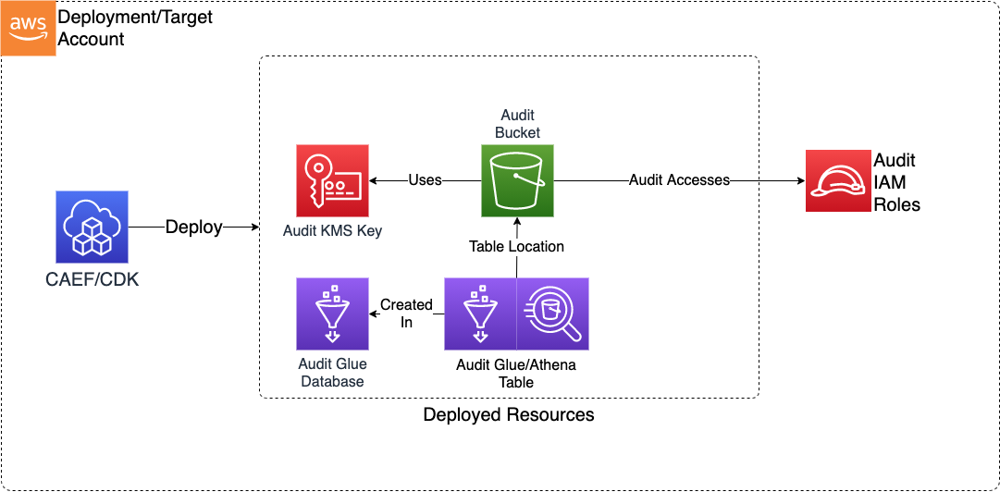

# CloudTrail Audit

> **Note:** This documentation is also available in a rendered format [here](https://aws.github.io/modern-data-architecture-accelerator/packages/apps/governance/audit-app/index.html).

Deploys a secure, KMS-encrypted S3 audit bucket for CloudTrail logs and S3 inventories, with Glue/Athena tables for querying audit and inventory data. Supports cross-account and cross-region log aggregation. Use this module when you need a centralized audit log repository for compliance, security investigations, or tracking data access across your AWS accounts.

---

## Deployed Resources

This module deploys and integrates the following resources:

**Audit KMS Key** - Customer-managed KMS key for encrypting all audit resources at rest.

**Audit S3 Bucket** - S3 bucket for CloudTrail audit logs and S3 Inventory data.

**Glue Database** - Glue catalog database containing the audit and inventory tables.

**Glue/Athena Audit Table** - Athena table for querying CloudTrail data in the Audit Bucket.

**Glue/Athena Inventory Table** - Athena table for querying S3 Inventory data in the Audit Bucket.



---

## Related Modules

- [Data Lake](../../datalake/datalake-app/README.md) — Audit S3 Inventory data from data lake buckets can be stored and queried in the audit bucket
- [Audit Trail](../audit-trail-app/README.md) — Deploy a CloudTrail trail that writes audit logs to the S3 bucket and KMS key created by this module
- [Athena Workgroup](../../datalake/athena-workgroup-app/README.md) — Use Athena workgroups to query CloudTrail and S3 Inventory data in the audit tables
- [Roles](../roles-app/README.md) — Create IAM roles that can be granted read access to audit data

---

## Security/Compliance Details

This module is designed in alignment with MDAA security/compliance principles and CDK nag rulesets. Additional review is recommended prior to production deployment, ensuring organization-specific compliance requirements are met.

- **Encryption at Rest**:
  - All audit data encrypted with customer-managed KMS key
  - Read roles granted decrypt-only access via key policy
- **Least Privilege**:
  - Bucket policy restricts write access to CloudTrail and S3 Inventory services
  - Read roles granted readonly access via bucket policy
  - Cross-account and cross-region source restrictions configurable

---

## Configuration

### MDAA Config

Add the following snippet to your mdaa.yaml under the `modules:` section of a domain/env in order to use this module:

```yaml
audit: # Module Name can be customized
  module_path: '@aws-mdaa/audit' # Must match module NPM package name
  module_configs:
    - ./audit.yaml # Filename/path can be customized
```

### Module Config Samples and Variants

Copy the contents of the relevant sample config below into the `./audit.yaml` file referenced in the MDAA config snippet above.

#### Minimal Configuration

Deploys an S3 audit bucket with read access for a single role. All properties are optional, but at least one readRole or sourceAccount is recommended for a useful deployment. Start here for a basic audit bucket in a single-account setup.

[sample-config-minimal.yaml](sample_configs/sample-config-minimal.yaml)

```yaml
--8<-- "sample_configs/sample-config-minimal.yaml"
```

#### Comprehensive Configuration

Creates an S3 audit bucket that collects audit logs and S3 inventory reports from source accounts and regions, with read access via IAM roles and Athena-queryable inventory tables. Start here when evaluating all available options for cross-account log aggregation, multi-region collection, and Athena-based audit querying.

[sample-config-comprehensive.yaml](sample_configs/sample-config-comprehensive.yaml)

```yaml
--8<-- "sample_configs/sample-config-comprehensive.yaml"
```

---

[Config Schema Docs](SCHEMA.md)
