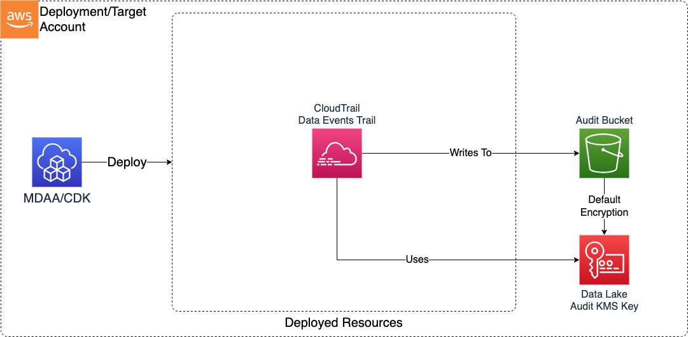

# CloudTrail Trails

This Audit Trail CDK application is used to configure deploy the resources required to define a secure S3-based Audit Trail on AWS.

***

## Deployed Resources and Compliance Details



**CloudTrail Audit Trail** - CloudTrail containing S3 Data Events will be configured to write to an audit bucket

## Configuration

### MDAA Config

Add the following snippet to your mdaa.yaml under the `modules:` section of a domain/env in order to use this module:

```yaml
          audit-trail: # Module Name can be customized
            cdk_app: "@aws-caef/audit-trail" # Must match module NPM package name
            app_configs:
              - ./audit-trail.yaml # Filename/path can be customized
```

### Module Config (./audit-trail.yaml)

[Config Schema Docs](SCHEMA.md)

```yaml
trail:
  # The name of the bucket to which audit events will be written
  cloudTrailAuditBucketName: ssm:/sample-org/shared/audit/bucket/name
  # The Arn of the KMS CMK which will be used to encrypt audit logs
  cloudTrailAuditKmsKeyArn: ssm:/sample-org/shared/audit/kms/cmk/arn
  # Optionally include control plane events in trail
  includeManagementEvents: true
```
