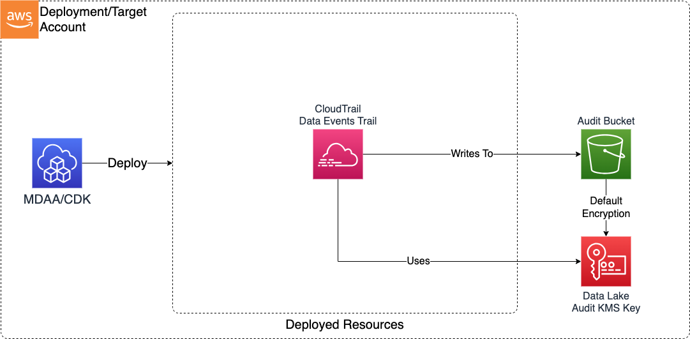

# CloudTrail Trails

> **Note:** This documentation is also available in a rendered format [here](https://aws.github.io/modern-data-architecture-accelerator/packages/apps/governance/audit-trail-app/index.html).

Deploys CloudTrail trails for data events with KMS-encrypted log delivery to an existing audit bucket. Optionally includes management events. Use this module when you need to track who accessed or modified objects in your S3 buckets, or invoked other supported resources such as Bedrock AgentCore runtimes and Lambda functions, for security auditing and compliance requirements.

---

## Deployed Resources

This module deploys and integrates the following resources:

**CloudTrail Audit Trail** - CloudTrail containing S3 Data Events configured to write to an audit bucket.



---

## Related Modules

- [Audit](../audit-app/README.md) — Deploy the audit S3 bucket and KMS key that this trail writes to
- [Data Lake](../../datalake/datalake-app/README.md) — Enable S3 data event logging for data lake bucket access auditing
- [Lake Formation Settings](../lakeformation-settings-app/README.md) — Configure Lake Formation admin roles whose actions are captured by CloudTrail

---

## Security/Compliance Details

This module is designed in alignment with MDAA security/compliance principles and CDK nag rulesets. Additional review is recommended prior to production deployment, ensuring organization-specific compliance requirements are met.

- **Encryption at Rest**:
  - Trail logs encrypted with existing audit KMS key referenced via SSM parameter

---

## Configuration

### MDAA Config

Add the following snippet to your mdaa.yaml under the `modules:` section of a domain/env in order to use this module:

```yaml
audit-trail: # Module Name can be customized
  module_path: '@aws-mdaa/audit-trail' # Must match module NPM package name
  module_configs:
    - ./audit-trail.yaml # Filename/path can be customized
```

### Module Config Samples and Variants

Copy the contents of the relevant sample config below into the `./audit-trail.yaml` file referenced in the MDAA config snippet above.

#### Minimal Configuration

Required properties only — a CloudTrail trail with audit bucket and KMS key references. Start here for a basic S3 data event trail writing to an existing audit bucket.

[sample-config-minimal.yaml](sample_configs/sample-config-minimal.yaml)

```yaml
# Contents available via above link
--8<-- "target/docs/packages/apps/governance/audit-trail-app/sample_configs/sample-config-minimal.yaml"
```

#### Comprehensive Configuration

Covers all available options including management events, scoped event selectors targeting specific buckets and prefixes, and multiple named trails via the `trails` property. Demonstrates both the legacy single `trail` and additional named `trails` coexisting in one config.

[sample-config-comprehensive.yaml](sample_configs/sample-config-comprehensive.yaml)

```yaml
# Contents available via above link
--8<-- "target/docs/packages/apps/governance/audit-trail-app/sample_configs/sample-config-comprehensive.yaml"
```

#### Trails Only

Uses only the `trails` property without the legacy `trail` — for deployments that exclusively use named trails without needing the default `s3-audit` trail.

[sample-config-trails-only.yaml](sample_configs/sample-config-trails-only.yaml)

```yaml
# Contents available via above link
--8<-- "target/docs/packages/apps/governance/audit-trail-app/sample_configs/sample-config-trails-only.yaml"
```

#### Data Events (non-S3 resource types)

Uses `dataEventSelectors` to capture CloudTrail data events for any supported resource type — Bedrock AgentCore, Lambda, DynamoDB, and so on — rather than S3 only. A separate config because the two selector styles cannot be combined on one trail (see below).

[sample-config-data-events.yaml](sample_configs/sample-config-data-events.yaml)

```yaml
# Contents available via above link
--8<-- "target/docs/packages/apps/governance/audit-trail-app/sample_configs/sample-config-data-events.yaml"
```

---

## Data Event Selectors

`eventSelectors` captures S3 data events only. To capture data events for any other resource type, use `dataEventSelectors`, which renders CloudTrail [advanced event selectors](https://docs.aws.amazon.com/awscloudtrail/latest/userguide/filtering-data-events.html).

The two are **mutually exclusive on a single trail** — CloudTrail accepts either basic or advanced event selectors, never both. Setting both on one trail fails at synth. To use both styles, split them across separate trails.

Behaviors worth knowing before configuring these:

- **One resource type per selector.** CloudTrail rejects a selector naming more than one `resources.type`, so capturing several types means several `dataEventSelectors` entries. For an AgentCore runtime, that usually means both `AWS::BedrockAgentCore::Runtime` and `AWS::BedrockAgentCore::RuntimeEndpoint`.
- **`includeManagementEvents` matters more here.** Advanced event selectors replace a trail's default selectors outright, so a trail with `dataEventSelectors` and no `includeManagementEvents: true` captures **no control plane events at all**. Set it to `true` when the same trail should also cover lifecycle calls such as `UpdateAgentRuntime` or `DeleteAgentRuntime`.
- **`resourceArns` is matched as a prefix** (`StartsWith`), so a parent ARN also covers resources beneath it — an AgentCore runtime ARN prefixes its runtime endpoints. Resource types with flat ARNs, such as Lambda functions and DynamoDB tables, have no such hierarchy, so a partial ARN also matches any other resource sharing that prefix: give the full ARN unless a prefix match is what you want. Omitting it captures every resource of the type in the account, which is the most expensive option.
- **Data events are billed per event** and can be high volume. Scope with `resourceArns`, and use `readWriteType` where only one direction is of interest.
- **Valid `resourceType` values are validated by CloudTrail at deploy, not at synth.** An unsupported value is rejected when the trail is created. The supported values are listed in the CloudTrail [data events documentation](https://docs.aws.amazon.com/awscloudtrail/latest/userguide/logging-data-events-with-cloudtrail.html#logging-data-events).
- **Event delivery to EventBridge lags** by a few minutes. A test that triggers an event and immediately asserts on delivery needs to poll rather than check once.

### Enabling EventBridge alerting on AgentCore invocations

EventBridge rules matching `AWS API Call via CloudTrail` events only fire if a trail in the same account and region logs those events. Management events are logged by any trail with management logging enabled, but **data events — including `InvokeAgentRuntime` and the `AccessDenied` it records on a denied invocation — are off by default**. Without a trail configured for them, rules scoped to invocation failures deploy cleanly and never fire.

The Data Events sample config above deploys such a trail. Point `resourceArns` at the runtime being audited, and keep `includeManagementEvents: true` so control plane rules keep working on the same trail.

---

[Config Schema Docs](SCHEMA.md)
