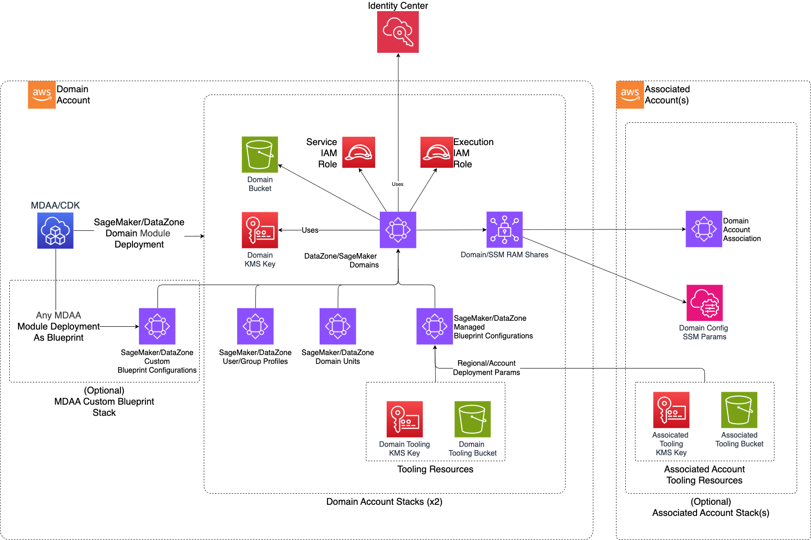

# DataZone

> **Note:** This documentation is also available in a rendered format [here](https://aws.github.io/modern-data-architecture-accelerator/packages/apps/governance/datazone-app/index.html).

Deploys Amazon DataZone (V1) domains with domain units, user/group profiles, environment blueprints, associated accounts, KMS encryption, and Lake Formation integration for governed data sharing. DataZone V1 is the predecessor to SageMaker Unified Studio. Choose this module if you have an existing DataZone V1 deployment; for new deployments, consider the [SageMaker module](../sagemaker-app/README.md) which provides the latest SageMaker Unified Studio experience with a unified portal for data engineering, analytics, and ML. Use this module when you need a governed data catalog and sharing portal for teams to discover, request access to, and consume data assets across organizational boundaries.

---

## Deployed Resources

This module deploys and integrates the following resources:

**DataZone Domain** - A DataZone Domain with configurable SSO and user assignment modes.

**DataZone Domain Units** - Hierarchical organizational units for project creation.

**DataZone User/Group Profiles** - User/Group profiles for IAM and SSO principals.

**KMS CMK** - Customer-managed encryption key per domain.

**Domain Execution Role** - IAM Role used by DataZone, specific to each domain.

**Domain Bucket** - S3 bucket for domain-specific resources.

**Associated Account Stacks** - Cross-account resources for multi-account domain access.



---

## Related Modules

- [Lake Formation Settings](../lakeformation-settings-app/README.md) — Configure Lake Formation admin roles required for DataZone domain data governance
- [Glue Catalog Settings](../glue-catalog-app/README.md) — Configure cross-account Glue Catalog encryption keys for associated accounts
- [Roles](../roles-app/README.md) — Create IAM roles for DataZone domain user/group profiles
- [SageMaker (Domain)](../sagemaker-app/README.md) — Alternative to DataZone for governed data access and project management using SageMaker Unified Studio

---

## Security/Compliance Details

This module is designed in alignment with MDAA security/compliance principles and CDK nag rulesets. Additional review is recommended prior to production deployment, ensuring organization-specific compliance requirements are met.

- **Encryption at Rest**:
  - Each domain encrypted with a dedicated customer-managed KMS key
  - Glue catalog encryption key integration for metadata access
- **Least Privilege**:
  - Domain unit ownership model with user/group-level access
  - SSO and IAM authentication modes
- **Separation of Duties**:
  - Lake Formation admin role integration for fine-grained data access control
  - Associated accounts with configurable Glue catalog KMS key access and per-account Lake Formation admin roles

---

## Configuration

### MDAA Config

Add the following snippet to your mdaa.yaml under the `modules:` section of a domain/env in order to use this module:

```yaml
datazone: # Module Name can be customized
  module_path: '@aws-mdaa/datazone' # Must match module NPM package name
  module_configs:
    - ./datazone.yaml # Filename/path can be customized
```

### Module Config Samples and Variants

Copy the contents of the relevant sample config below into the `./datazone.yaml` file referenced in the MDAA config snippet above.

#### Minimal Configuration

Required properties only — a single domain with an admin role. Start here for a basic DataZone domain with a single administrator.

[sample-config-minimal.yaml](sample_configs/sample-config-minimal.yaml)

```yaml
# Contents available via above link
--8<-- "target/docs/packages/apps/governance/datazone-app/sample_configs/sample-config-minimal.yaml"
```

#### Comprehensive Configuration

Covers both enum variants, all PolicyType values, nested domain units, cross-account associations, and all principal types. Start here when evaluating all available options for domain units, user/group profiles, environment blueprints, and multi-account governance.

[sample-config-comprehensive.yaml](sample_configs/sample-config-comprehensive.yaml)

```yaml
# Contents available via above link
--8<-- "target/docs/packages/apps/governance/datazone-app/sample_configs/sample-config-comprehensive.yaml"
```

---

[Config Schema Docs](SCHEMA.md)
