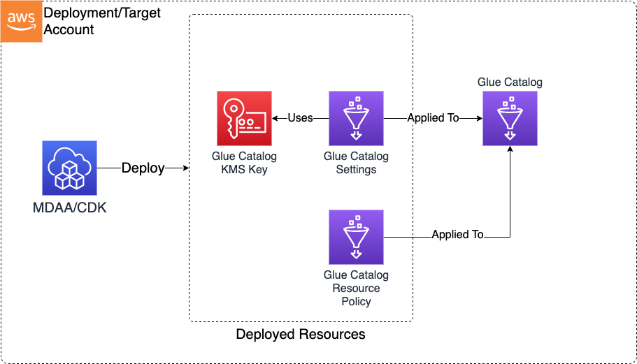

# Glue Catalog Settings

The Glue Catalog CDK application is used to configure an account's Glue Catalog for encryption at rest and cross account access for Data Mesh deployments. It should be deployed only once per AWS account.

***

## Deployed Resources and Compliance Details



**Glue Catalog KMS Key** - This key will be used to encrypt the Glue Catalog metadata.
  
* Key usage via the Glue service, within the local account is permitted by default (by key policy)
* Additional key usage via Glue service granted for each consumer account (by key policy)
* Additional permissions may be granted via IAM policy

**Glue Catalog Settings** - These settings will be deployed in order to configure the Glue Catalog to utilize the Catalog KMS Key.

* Each consumer account granted read access to the catalog via catalog resource policy

**Athena Data Source** - Each configured producer account will create an Athena Data Source pointing to the producer account's Glue Catalog

* Does not grant any access unless otherwise granted on producer account's Glue Catalog resource policy

***

## Configuration

### MDAA Config

Add the following snippet to your mdaa.yaml under the `modules:` section of a domain/env in order to use this module:

```yaml
          glue-catalog: # Module Name can be customized
            cdk_app: "@aws-caef/glue-catalog" # Must match module NPM package name
            app_configs:
              - ./glue-catalog.yaml # Filename/path can be customized
```

### Module Config (./glue-catalog.yaml)

[Config Schema Docs](SCHEMA.md)

The Glue Catalog CDK accepts an optional configuration, which can be used to configure cross account catalog access for data mesh implementations.

These configs can be used to generate cross account catalog access for use in a data mesh or hub/spoke archicture

### Complete Data Mesh

A complete mesh can be generated by deploying the same config to all node accounts within the data mesh:

```yaml
# An optional list of consumer accounts which will be provided read access to the catalog in the deployment account.
consumerAccounts:
  node1: "1234567890"
  node2: "0987654321"
# An optional list of consumer accounts which will be provided read access to the catalog KMS Key only in the deployment account.
kmsKeyConsumerAccounts:
  node3: "5678901234"
# A optional list of producer accounts for which additional Athena catalogs will be created in the deployment account.
producerAccounts:
  node1: "1234567890"
  node2: "0987654321"
  node3: "5678901234"
```

### Partial Data Mesh

A partial mesh can be generated by deploying separate configs to all node accounts specifying only the
producer/consumer relationships required by the partial mesh

Deployed to node1 account:

```yaml
# An optional list of consumer accounts which will be provided read access to the catalog in the deployment account.
consumerAccounts:
  node1: "1234567890"
  node2: "0987654321"
  node3: "5678901234"
# A optional list of producer accounts for which additional Athena catalogs will be created in the deployment account.
producerAccounts:
  node1: "1234567890"
  node2: "0987654321"
  node3: "5678901234"
```

Deployed to node2 account, grants catalog read access from node 1 and node3 accounts, and creates additional catalog pointing at node1:

```yaml
# An optional list of consumer accounts which will be provided read access to the catalog in the deployment account.
consumerAccounts:
  node1: "1234567890"
  node3: "5678901234"
# A optional list of producer accounts for which additional Athena catalogs will be created in the deployment account.
producerAccounts:
  node1: "1234567890"
```

Deployed to node3 account, grants catalog read access from node1 account, and creates additional data source pointing at node1:

```yaml
# An optional list of consumer accounts which will be provided read access to the catalog in the deployment account.
consumerAccounts:
  node1: "1234567890"
# A optional list of producer accounts for which additional Athena catalogs will be created in the deployment account.
producerAccounts:
  node1: "1234567890"
```

### Hub/Spoke Data Mesh

Deployed to hub account, grants read access from spoke accounts to hub catalog, and creates additional data sources within hub for each spoke.

```yaml
# An optional list of consumer accounts which will be provided read access to the catalog in the deployment account.
consumerAccounts:
  spoke1: "1234567890"
  spoke2: "0987654321"

# A optional list of producer accounts for which additional Athena catalogs will be created in the deployment account.
producerAccounts:
  spoke1: "1234567890"
  spoke2: "0987654321"

```

Deployed to each spoke account, grants read access from hub to spoke catalogs, and creates additional data sources within each spoke account pointing at the hub catalog.

```yaml
# An optional list of consumer accounts which will be provided read access to the catalog in the deployment account.
consumerAccounts:
  hub: "5678901234"
# A optional list of producer accounts for which additional Athena catalogs will be created in the deployment account.
producerAccounts:
  hub: "5678901234"
```
