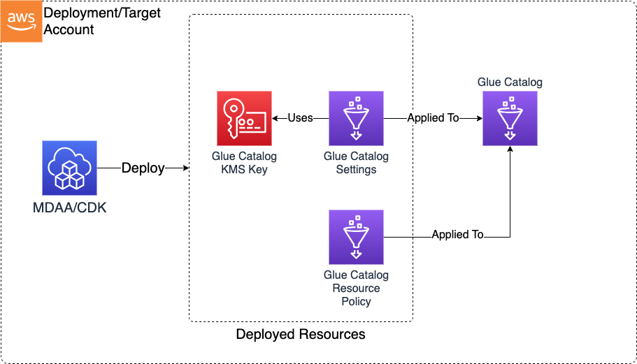

# Glue Catalog Settings

> **Note:** This documentation is also available in a rendered format [here](https://aws.github.io/modern-data-architecture-accelerator/packages/apps/governance/glue-catalog-app/index.html).

Configures an account's Glue Catalog for encryption at rest and cross-account access for data mesh deployments. Supports complete mesh, partial mesh, and hub/spoke topologies. Should be deployed only once per AWS account. Use this module when you need to encrypt your Glue Catalog metadata and enable cross-account data sharing for multi-account data mesh or hub-and-spoke architectures.

---

## Deployed Resources

This module deploys and integrates the following resources:

**Glue Catalog KMS Key** - Customer-managed KMS key for encrypting Glue Catalog metadata at rest.

**Glue Catalog Settings** - Configures the Glue Catalog to use the Catalog KMS Key for encryption.

**Catalog Resource Policy** - Glue Catalog resource policy granting cross-account read access to consumer accounts.

**Athena Data Source** - Each configured producer account creates an Athena Data Source pointing to the producer's Glue Catalog for cross-account queries.

**RAM Resource Share** (Optional) - Shares the Catalog KMS Key SSM parameter with consumer accounts for cross-account key discovery.

**SSM Parameters** - Catalog KMS Key ARN stored in Parameter Store for cross-module reference.



---

## Related Modules

- [Data Lake](../../datalake/datalake-app/README.md) — Data lake buckets and Glue databases use the Glue Catalog encryption configured by this module
- [Lake Formation Settings](../lakeformation-settings-app/README.md) — Configure Lake Formation admin roles and IAM Allowed Principals behavior for the account
- [DataZone](../datazone-app/README.md) — DataZone associated accounts require access to the Glue Catalog KMS key configured here
- [SageMaker (Domain)](../sagemaker-app/README.md) — SageMaker associated accounts require access to the Glue Catalog KMS key configured here
- [DataOps Project](../../dataops/dataops-project-app/README.md) — Project Glue databases are encrypted with the Catalog KMS key configured here

---

## Security/Compliance Details

This module is designed in alignment with MDAA security/compliance principles and CDK nag rulesets. Additional review is recommended prior to production deployment, ensuring organization-specific compliance requirements are met.

- **Encryption at Rest**:
  - Glue Catalog metadata encrypted with customer-managed KMS key
  - Key usage via Glue service within local account permitted by default
  - Consumer accounts granted scoped key usage via key policy
  - KMS-only consumer accounts can be granted decrypt access without catalog read
- **Least Privilege**:
  - Catalog resource policy grants read access to consumer accounts
  - KMS-only consumer accounts can decrypt metadata without catalog read access
- **Separation of Duties**:
  - Athena data sources provide cross-account query access without granting underlying catalog permissions

---

## Configuration

### MDAA Config

Add the following snippet to your mdaa.yaml under the `modules:` section of a domain/env in order to use this module:

```yaml
glue-catalog: # Module Name can be customized
  module_path: '@aws-mdaa/glue-catalog' # Must match module NPM package name
  # module_configs is optional — all properties are optional.
  # Omit to deploy the Glue Catalog KMS key and encryption
  # settings with defaults.
  module_configs:
    - ./glue-catalog.yaml # Filename/path can be customized
```

### Module Config Samples and Variants

Copy the contents of the relevant sample config below into the `./glue-catalog.yaml` file referenced in the MDAA config snippet above.

#### Minimal Configuration

Deploys the Glue Catalog KMS key and encryption settings. All properties are optional — this config demonstrates a single consumer account for cross-account catalog access. Start here for a basic encrypted Glue Catalog with optional cross-account sharing.

[sample-config-minimal.yaml](sample_configs/sample-config-minimal.yaml)

```yaml
# Contents available via above link
--8<-- "target/docs/packages/apps/governance/glue-catalog-app/sample_configs/sample-config-minimal.yaml"
```

#### Comprehensive Configuration

Manages cross-account Glue Catalog access through consumer/producer account mappings, KMS key sharing, and resource-scoped access policies for fine-grained data governance. Start here when evaluating all available options for data mesh topologies, Athena data sources, and multi-account catalog sharing.

[sample-config-comprehensive.yaml](sample_configs/sample-config-comprehensive.yaml)

```yaml
# Contents available via above link
--8<-- "target/docs/packages/apps/governance/glue-catalog-app/sample_configs/sample-config-comprehensive.yaml"
```

---

[Config Schema Docs](SCHEMA.md)
