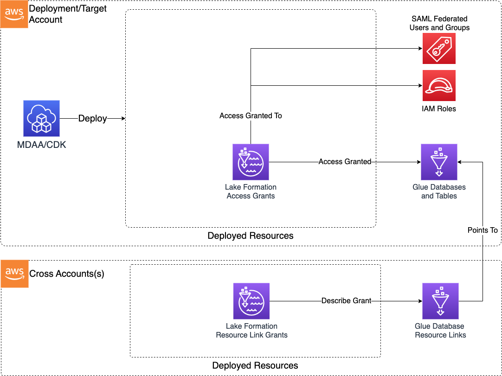

# Lake Formation Access Control

> **Note:** This documentation is also available in a rendered format [here](https://aws.github.io/modern-data-architecture-accelerator/packages/apps/governance/lakeformation-access-control-app/index.html).

Deploys Lake Formation fine-grained access grants for databases and tables, supporting federated users/groups, IAM roles, and cross-account resource links. This module should be used to manage LF grants to Glue resources created outside of MDAA. For Glue resources created within the DataOps Project module, grants can be configured within the module itself. Use this module when you need to grant specific users, groups, or roles read, write, or admin access to Glue databases and tables that were created outside of your DataOps projects.

---

## Deployed Resources

This module deploys and integrates the following resources:

**Lake Formation Access Grants** - Grants deployed for each specification in the config.

- Database or table scoped grants (read, write, or super)
- Supports role, federated user, and federated group principals

**Lake Formation Cross Account Resource Link Grants** - Optional cross-account describe grants pointing to resource links.



---

## Related Modules

- [Lake Formation Settings](../lakeformation-settings-app/README.md) — Configure account-level Lake Formation admin roles and IAM Allowed Principals behavior before deploying access grants
- [Data Lake](../../datalake/datalake-app/README.md) — Data lake buckets register Lake Formation locations that this module can grant access to
- [DataOps Project](../../dataops/dataops-project-app/README.md) — DataOps projects can configure Lake Formation grants directly; use this module for Glue resources created outside of MDAA
- [Roles](../roles-app/README.md) — Create IAM roles that can be used as principals for Lake Formation grants
- [Glue Catalog Settings](../glue-catalog-app/README.md) — Configure cross-account Glue Catalog access for resource link grants

---

## Security/Compliance Details

This module is designed in alignment with MDAA security/compliance principles and CDK nag rulesets. Additional review is recommended prior to production deployment, ensuring organization-specific compliance requirements are met.

- **Least Privilege**:
  - Fine-grained Lake Formation grants at database and table level
  - Three permission tiers: read (SELECT/DESCRIBE), write (INSERT/DELETE), and super (ALTER/DROP)
- **Separation of Duties**:
  - Supports SAML-federated users and groups via IAM identity providers
  - Cross-account resource links with describe grants for data mesh/hub-spoke architectures

---

## Configuration

### MDAA Config

Add the following snippet to your mdaa.yaml under the `modules:` section of a domain/env in order to use this module:

```yaml
lakeformation-access-control: # Module Name can be customized
  module_path: '@aws-mdaa/lakeformation-access-control' # Must match module NPM package name
  module_configs:
    - ./lakeformation-access-control.yaml # Filename/path can be customized
```

### Module Config Samples and Variants

Copy the contents of the relevant sample config below into the `./lakeformation-access-control.yaml` file referenced in the MDAA config snippet above.

#### Minimal Configuration

Required properties only — a single IAM role principal with a basic database grant. Start here for a straightforward Lake Formation grant to one role on one database.

[sample-config-minimal.yaml](sample_configs/sample-config-minimal.yaml)

```yaml
# Contents available via above link
--8<-- "target/docs/packages/apps/governance/lakeformation-access-control-app/sample_configs/sample-config-minimal.yaml"
```

#### Comprehensive Configuration

All optional properties covered — federation providers, federated user/group and IAM role principals, database and table-scoped permissions, and local/cross-account resource links. Start here when evaluating all available options for principal types, permission tiers, and cross-account resource link grants.

[sample-config-comprehensive.yaml](sample_configs/sample-config-comprehensive.yaml)

```yaml
# Contents available via above link
--8<-- "target/docs/packages/apps/governance/lakeformation-access-control-app/sample_configs/sample-config-comprehensive.yaml"
```

---

[Config Schema Docs](SCHEMA.md)
