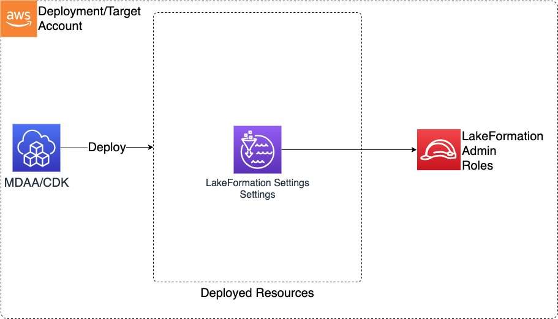

# Lake Formation Settings

> **Note:** This documentation is also available in a rendered format [here](https://aws.github.io/modern-data-architecture-accelerator/packages/apps/governance/lakeformation-settings-app/index.html).

Configures account-level Lake Formation settings including administrator roles, default IAM Allowed Principals behavior, DataZone admin role creation, and IAM Identity Center integration. Use this module as a prerequisite when setting up Lake Formation-based data governance, to establish admin roles and control whether new Glue resources default to IAM or Lake Formation permissions.

> ⚠️ **Account-Level Module** — This module can only be deployed once per AWS account. A second deployment to the same account will fail. See [Account-Level Modules](../../../DEPLOYMENT.md#account-level-modules) for details.

---

## Deployed Resources

This module deploys and integrates the following resources:

**LakeFormation Settings** - Configures LakeFormation administrator roles and default permissions behavior for IAM Allowed Principals on new Glue Databases/Tables.

**DataZone Manage Access Role** (Optional) - IAM role with cross-account trust for centralized DataZone data governance, with ARN stored in SSM Parameter Store.

**IAM Identity Center Configuration** (Optional) - Configures Lake Formation integration with IAM Identity Center for SSO-based access.



---

## Related Modules

- [Lake Formation Access Control](../lakeformation-access-control-app/README.md) — Deploy fine-grained Lake Formation grants after configuring account-level settings with this module
- [Data Lake](../../datalake/datalake-app/README.md) — Data lake Lake Formation locations require admin roles configured by this module
- [DataZone](../datazone-app/README.md) — DataZone domains integrate with Lake Formation admin roles configured here
- [SageMaker (Domain)](../sagemaker-app/README.md) — SageMaker domains integrate with Lake Formation admin roles configured here
- [Glue Catalog Settings](../glue-catalog-app/README.md) — Configure Glue Catalog encryption alongside Lake Formation settings for the account

---

## Security/Compliance Details

This module is designed in alignment with MDAA security/compliance principles and CDK nag rulesets. Additional review is recommended prior to production deployment, ensuring organization-specific compliance requirements are met.

- **Least Privilege**:
  - Lake Formation admin roles (lakeFormationAdminRoles) control all data access grants
  - IAM Allowed Principals default configurable (disable for strict LF-only governance)
  - Optional CDK deploy role as LF admin for automated deployments
- **Separation of Duties**:
  - DataZone admin role with cross-account trust for centralized data governance
  - IAM Identity Center integration for SSO-based Lake Formation access

---

## Configuration

### MDAA Config

Add the following snippet to your mdaa.yaml under the `modules:` section of a domain/env in order to use this module:

```yaml
lakeformation-settings: # Module Name can be customized
  module_path: '@aws-mdaa/lakeformation-settings' # Must match module NPM package name
  module_configs:
    - ./lakeformation-settings.yaml # Filename/path can be customized
```

### Module Config Samples and Variants

Copy the contents of the relevant sample config below into the `./lakeformation-settings.yaml` file referenced in the MDAA config snippet above.

#### Minimal Configuration

Required properties only — Lake Formation admin roles and IAM Allowed Principals default. Start here for basic account-level Lake Formation setup with an admin role.

[sample-config-minimal.yaml](sample_configs/sample-config-minimal.yaml)

```yaml
# Contents available via above link
--8<-- "target/docs/packages/apps/governance/lakeformation-settings-app/sample_configs/sample-config-minimal.yaml"
```

#### Comprehensive Configuration

Covers Lake Formation admin roles, IAM permission defaults, cross-account sharing, DataZone integration, and IAM Identity Center integration for centralized data governance. Start here when evaluating all available options for admin roles, SSO integration, and cross-account DataZone governance.

[sample-config-comprehensive.yaml](sample_configs/sample-config-comprehensive.yaml)

```yaml
# Contents available via above link
--8<-- "target/docs/packages/apps/governance/lakeformation-settings-app/sample_configs/sample-config-comprehensive.yaml"
```

---

[Config Schema Docs](SCHEMA.md)
