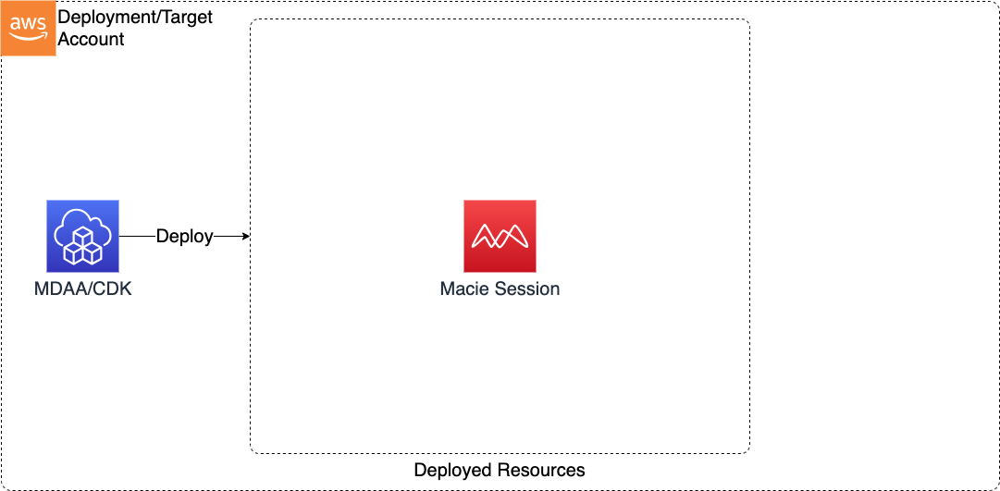

# Macie Session

> **Note:** This documentation is also available in a rendered format [here](https://aws.github.io/modern-data-architecture-accelerator/packages/apps/governance/macie-session-app/index.html).

Configures an Amazon Macie session for the account, enabling automated sensitive data discovery and classification with configurable finding publishing frequency. Use this module when you need to scan your S3 data for personally identifiable information (PII) and other sensitive data to meet data privacy and compliance requirements.

---

## Deployed Resources

This module deploys and integrates the following resources:

**Macie Session** - Account-level Macie session with configurable finding publishing frequency and status control.



---

## Related Modules

- [Data Lake](../../datalake/datalake-app/README.md) — Enable Macie sensitive data discovery on data lake S3 buckets

---

## Security/Compliance Details

This module is designed in alignment with MDAA security/compliance principles and CDK nag rulesets. Additional review is recommended prior to production deployment, ensuring organization-specific compliance requirements are met.

- **Compliance**:
  - Macie provides automated sensitive data discovery and classification, supporting data privacy and compliance requirements
  - Finding publishing frequency controls how often sensitive data findings are reported

---

## Configuration

### MDAA Config

Add the following snippet to your mdaa.yaml under the `modules:` section of a domain/env in order to use this module:

```yaml
macie-session: # Module Name can be customized
  module_path: '@aws-mdaa/macie-session' # Must match module NPM package name
  module_configs:
    - ./macie-session.yaml # Filename/path can be customized
```

### Module Config Samples and Variants

Copy the contents of the relevant sample config below into the `./macie-session.yaml` file referenced in the MDAA config snippet above.

#### Minimal Configuration

Required properties only — a Macie session with finding publishing frequency. Start here for enabling Macie sensitive data discovery in a single account.

[sample-config-minimal.yaml](sample_configs/sample-config-minimal.yaml)

```yaml
# Contents available via above link
--8<-- "target/docs/packages/apps/governance/macie-session-app/sample_configs/sample-config-minimal.yaml"
```

#### Comprehensive Configuration

Enables Amazon Macie for automated sensitive data discovery, PII detection, and data security monitoring, covering all enum variants for findingPublishingFrequency and status. Start here when evaluating all available options for publishing frequency and session status configurations.

[sample-config-comprehensive.yaml](sample_configs/sample-config-comprehensive.yaml)

```yaml
# Contents available via above link
--8<-- "target/docs/packages/apps/governance/macie-session-app/sample_configs/sample-config-comprehensive.yaml"
```

---

[Config Schema Docs](SCHEMA.md)
