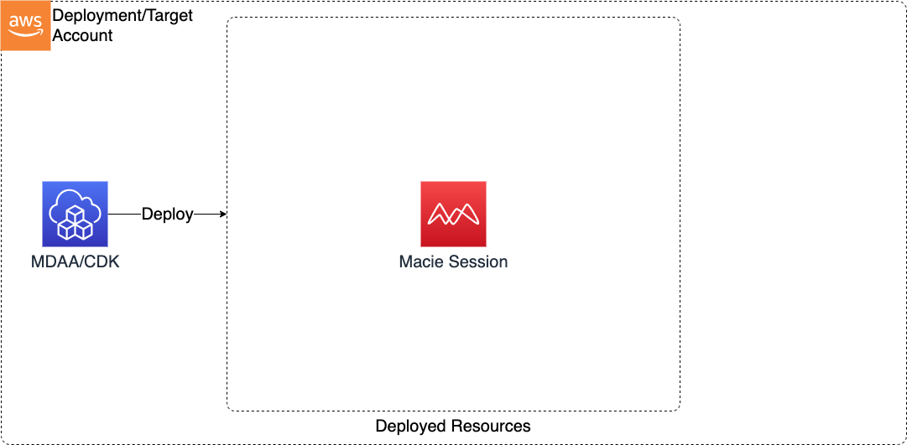

# Macie Session

This Macie Session CDK application is used to configure a the session account wise.

***

## Deployed Resources and Compliance Details



## Configuration

### MDAA Config

Add the following snippet to your mdaa.yaml under the `modules:` section of a domain/env in order to use this module:

```yaml
          macie-session: # Module Name can be customized
            cdk_app: "@aws-caef/macie-session" # Must match module NPM package name
            app_configs:
              - ./macie-session.yaml # Filename/path can be customized
```

### Module Config (./macie-session.yaml)

[Config Schema Docs](SCHEMA.md)

```yaml
# Configuration of Macie Session
session:
  # Frequency at which macie will publish updates
  # Possible values: FIFTEEN_MINUTES | ONE_HOUR | SIX_HOURS
  findingPublishingFrequency: SIX_HOURS
  # Optional - Status of Macie
  # Possible values (Default: ENABLED): ENABLED | PAUSED
  status: ENABLED
```
