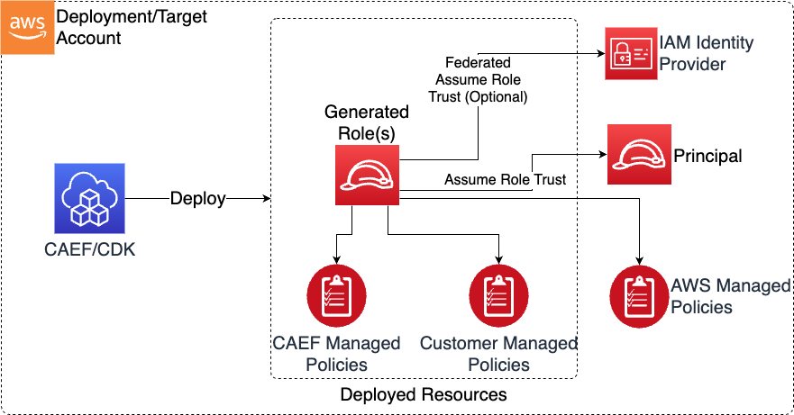

# IAM Roles and Policies

> **Note:** This documentation is also available in a rendered format [here](https://aws.github.io/modern-data-architecture-accelerator/packages/apps/governance/roles-app/index.html).

Deploys IAM roles, customer-managed policies, and SAML federation providers for a governed data environment. Supports persona-based policy assignment (data-admin, data-engineer, data-scientist, data-steward), multiple trust principal types, and CDK Nag suppression management. Use this module when you need to create IAM roles for your data teams that can be referenced across other MDAA modules for consistent, persona-based access control.

---

## Deployed Resources

This module deploys and integrates the following resources:

**IAM Managed Policies** - Customer-managed policies created from config-defined policy documents. MDAA persona-based managed policies optionally created for attachment to roles. Policies violating CDK Nag rules require explicit suppressions.

**IAM Roles** - Roles with configurable trust policies supporting account root, service principals, SAML federation, cross-account role ARNs, and assume role conditions. Roles can specify a base persona for automatic policy attachment.

**IAM Identity (Federation) Providers** - SAML identity providers for establishing federated assume-role trust into generated roles. New providers created from SAML metadata XML documents.

**SSM Parameters** - Role ARN and Role ID stored in Parameter Store for each generated role, enabling cross-module reference via `generated-role-id:` shorthand.



---

## Related Modules

- [Data Lake](../../datalake/datalake-app/README.md) — Roles created here can be referenced as data admin, read, write, or super roles on data lake buckets
- [Athena Workgroup](../../datalake/athena-workgroup-app/README.md) — Roles can be referenced as data admin or user roles for workgroup access
- [DataOps Project](../../dataops/dataops-project-app/README.md) — Roles can be referenced as data engineer, execution, or data admin roles for project resources
- [Data Warehouse](../../analytics/datawarehouse-app/README.md) — Roles can be used as execution roles or federation roles for Redshift access
- [Data Science Team](../../ai/data-science-team-app/README.md) — Roles can be referenced as team user or data admin roles for SageMaker and Athena access
- [Lake Formation Access Control](../lakeformation-access-control-app/README.md) — Roles can be used as principals for Lake Formation fine-grained access grants
- [SageMaker Studio](../../ai/sm-studio-domain-app/README.md) — Roles can be referenced as data admin roles or custom execution roles for Studio domains
- [QuickSight Namespace](../../analytics/quicksight-namespace-app/README.md) — Roles can be used for SAML federation into QuickSight namespaces

---

## Security/Compliance Details

This module is designed in alignment with MDAA security/compliance principles and CDK nag rulesets. Additional review is recommended prior to production deployment, ensuring organization-specific compliance requirements are met.

- **Least Privilege**:
  - Roles follow least-privilege principles with explicit trust policies
  - Persona-based managed policies provide standardized permission sets
  - CDK Nag integration validates security best practices with required suppressions for exceptions
- **Separation of Duties**:
  - Permission boundaries and CDK Nag rules help guide roles toward organizational security standards
  - SAML federation enables SSO integration with existing identity providers

---

## Configuration

### MDAA Config

Add the following snippet to your mdaa.yaml under the `modules:` section of a domain/env in order to use this module:

```yaml
roles: # Module Name can be customized
  module_path: '@aws-mdaa/roles' # Must match module NPM package name
  module_configs:
    - ./roles.yaml # Filename/path can be customized
```

### Module Config Samples and Variants

Copy the contents of the relevant sample config below into the `./roles.yaml` file referenced in the MDAA config snippet above.

#### Minimal Configuration

Creates a single IAM role with account-level trust. All properties are optional, but at least one role is recommended for a useful deployment. Start here for a basic role that other MDAA modules can reference.

[sample-config-minimal.yaml](sample_configs/sample-config-minimal.yaml)

```yaml
# Contents available via above link
--8<-- "target/docs/packages/apps/governance/roles-app/sample_configs/sample-config-minimal.yaml"
```

#### Comprehensive Configuration

Generates IAM roles, customer-managed policies, and SAML federation providers with persona-based policy assignment (data-admin, data-engineer, data-scientist), multiple trust principal types, and CDK Nag suppression management. Start here when evaluating all available options for personas, trust policies, SAML federation, and custom managed policies.

[sample-config-comprehensive.yaml](sample_configs/sample-config-comprehensive.yaml)

```yaml
# Contents available via above link
--8<-- "target/docs/packages/apps/governance/roles-app/sample_configs/sample-config-comprehensive.yaml"
```

---

[Config Schema Docs](SCHEMA.md)
