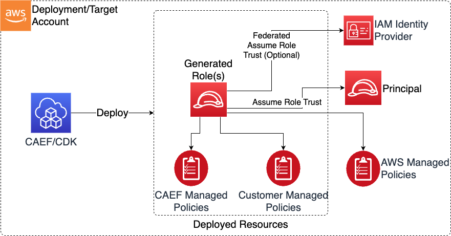

# IAM Roles and Policies

> **Note:** This documentation is also available in a rendered format [here](https://aws.github.io/modern-data-architecture-accelerator/packages/apps/governance/roles-app/index.html).

Deploys IAM roles, customer-managed policies, and SAML federation providers for a governed data environment. Supports persona-based policy assignment (data-admin, data-engineer, data-scientist, data-steward), multiple trust principal types including OIDC web identity federation, and CDK Nag suppression management. Use this module when you need to create IAM roles for your data teams that can be referenced across other MDAA modules for consistent, persona-based access control.

---

## Deployed Resources

This module deploys and integrates the following resources:

**IAM Managed Policies** - Customer-managed policies created from config-defined policy documents. MDAA persona-based managed policies optionally created for attachment to roles. Policies violating CDK Nag rules require explicit suppressions.

**IAM Roles** - Roles with configurable trust policies supporting account root, service principals, SAML federation, OIDC web identity federation, cross-account role ARNs, and assume role conditions. Roles can specify a base persona for automatic policy attachment.

A `webidentity:<oidc-provider-arn>` trusted principal produces an `sts:AssumeRoleWithWebIdentity` trust policy with a `Federated` principal for the given OIDC provider (e.g. GitLab CI/CD, GitHub Actions). Because OIDC providers are not account-bound, an unscoped web identity trust would permit any identity issued by the provider to assume the role; the module therefore requires `assumeRoleTrustConditions` that scope the trust on the provider's **own** identity claims whenever a `webidentity:` principal is used, and does not support `webidentity:` as an `additionalTrustedPrincipals` entry (which cannot carry conditions). Specifically, at least one condition key must be prefixed with the OIDC issuer host derived from the provider ARN (e.g. a `StringLike` on `gitlab.com:sub`). This rejects an empty `{}`, an empty operator such as `{ StringLike: {} }`, conditions that only constrain unrelated keys (e.g. `aws:RequestTag/*`), a provider claim matched against a bare `*` (e.g. `{ StringLike: { "gitlab.com:sub": "*" } }`), and provider claims behind operators that do not positively pin the identity — negation (`StringNotEquals`/`StringNotLike`), set operators satisfied when the claim is absent (`ForAllValues:*`), `*IfExists` variants, and `Null`. All of these would leave the OIDC principal effectively unscoped. Use a positive matching operator such as `StringEquals`/`StringLike` (or their `ForAnyValue:` variants). (The module does not attempt to judge how narrow a non-`*` value is; partial wildcards are the operator's responsibility.) For provider-federated CI/CD (e.g. GitLab CI/CD, GitHub Actions), scope on the `:sub` claim: the `:aud` claim is a constant shared by every tenant of the provider and does not isolate a specific project/branch. (Providers such as `cognito-identity.amazonaws.com`, where `:aud` is the identity-pool ID, are the exception — there `:aud` is itself the tenant boundary, so scoping on `<provider>:aud` is accepted.)

**IAM Identity (Federation) Providers** - SAML identity providers for establishing federated assume-role trust into generated roles. New providers created from SAML metadata XML documents.

**SSM Parameters** - Role ARN and Role ID stored in Parameter Store for each generated role, enabling cross-module reference via `generated-role-id:` shorthand. A role can optionally share these with other accounts - see [Sharing a Role with Another Account](#sharing-a-role-with-another-account).



---

## Related Modules

- [Data Lake](../../datalake/datalake-app/README.md) — Roles created here can be referenced as data admin, read, write, or super roles on data lake buckets
- [Athena Workgroup](../../datalake/athena-workgroup-app/README.md) — Roles can be referenced as data admin or user roles for workgroup access
- [DataOps Project](../../dataops/dataops-project-app/README.md) — Roles can be referenced as data engineer, execution, or data admin roles for project resources
- [Data Warehouse](../../analytics/datawarehouse-app/README.md) — Roles can be used as execution roles or federation roles for Redshift access
- [Data Science Team](../../ai/data-science-team-app/README.md) — Roles can be referenced as team user or data admin roles for SageMaker and Athena access
- [Lake Formation Access Control](../lakeformation-access-control-app/README.md) — Roles can be used as principals for Lake Formation fine-grained access grants
- [SageMaker Studio](../../ai/sm-studio-domain-app/README.md) — Roles can be referenced as data admin roles or custom execution roles for Studio domains
- [QuickSight Namespace](../../analytics/quicksight-namespace-app/README.md) — Roles can be used for SAML federation into QuickSight namespaces

---

## Security/Compliance Details

This module is designed in alignment with MDAA security/compliance principles and CDK nag rulesets. Additional review is recommended prior to production deployment, ensuring organization-specific compliance requirements are met.

- **Least Privilege**:
  - Roles follow least-privilege principles with explicit trust policies
  - Persona-based managed policies provide standardized permission sets
  - CDK Nag integration validates security best practices with required suppressions for exceptions
- **Separation of Duties**:
  - Permission boundaries and CDK Nag rules help guide roles toward organizational security standards
  - SAML federation enables SSO integration with existing identity providers
- **Cross-Account Parameter Sharing**:
  - Opt-in and default-off; a role's parameters are shared only with the accounts its config names
  - What is shared is the role's ARN and id, not any permission to assume it

---

## Sharing a Role with Another Account

A deployment in another account sometimes has to name one of these roles - in a bucket policy, a KMS key policy, or as an S3 replication role - and it cannot build the ARN itself, because MDAA truncates a role name at 64 characters with a hash of the untruncated name. `shareParametersWithAccounts` lets the named accounts read the role's ARN and id parameters instead:

```yaml
generateRoles:
  s3-replication:
    trustedPrincipal: service:s3.amazonaws.com
    shareParametersWithAccounts:
      - '222222222222'
```

The consumer then references the parameter by its full ARN, and CloudFormation resolves it at deploy time:

```yaml
# in the consuming data lake's module config, not in this module's
buckets:
  curated:
    accessPolicies: [Root]
    replication:
      inbound:
        sourceReplicationRoleArn: 'ssm:arn:{{partition}}:ssm:{{region}}:{{context:roles_account}}:parameter/{{org}}/<domain>/generated-role/s3-replication/arn'
        sourceAccount: '{{context:roles_account}}'
```

These parameter paths assume the default SSM layout. With the `@mdaaIncludeEnvInSsmPath` flag enabled, `env` is inserted after the domain - `parameter/{{org}}/<domain>/<env>/<module>/...`.

Worth knowing before turning it on:

- **Only the `generated-role/<name>/{arn,id}` parameters are shared.** The same role's conventional `<module>/role/<name>/{arn,id,name}` parameters stay Standard-tier and unshared, so a consumer following that path gets AccessDenied with no indication why.
- **Only the accounts named here can read the parameters.** A RAM share always names its principals, and this module has no way to know which deployments consume the roles it creates, so it cannot be inferred.
- **Sharing is confined to your AWS Organization.** The share sets `allowExternalPrincipals: false`, so only accounts in the same organization as the account this module deploys into can be named, and the deployment fails if one is not. Within the organization the share is accepted automatically, provided RAM sharing is enabled for it (`aws ram enable-sharing-with-aws-organization`). This keeps the share usable by a consumer deployed in the same `mdaa deploy` run, which is what it exists for; to hand a role ARN to an account in another organization, state it as a literal in that account's config.
- **The role's parameters move to the Advanced tier**, which RAM requires in order to share them and which AWS bills. Roles without this field are unaffected and stay Standard-tier. Turning it on is a one-way change for the parameters it covers: AWS does not allow an Advanced-tier parameter to be moved back to Standard, so removing this field later leaves them Advanced and still billed until they are deleted and recreated out of band.
- **The reading account must be in the same region.** A parameter reference is resolved by CloudFormation in the region of the stack reading it, and a parameter exists only in the region that published it.
- **Sharing a parameter grants no access to the role.** It exposes the ARN and id, nothing else; who may assume the role is still governed entirely by its trust policy.
- **The consuming account needs its own permission too.** The CloudFormation execution role there still needs `ssm:GetParameter*` on the shared parameter.

---

## Configuration

### MDAA Config

Add the following snippet to your mdaa.yaml under the `modules:` section of a domain/env in order to use this module:

```yaml
roles: # Module Name can be customized
  module_path: '@aws-mdaa/roles' # Must match module NPM package name
  module_configs:
    - ./roles.yaml # Filename/path can be customized
```

### Module Config Samples and Variants

Copy the contents of the relevant sample config below into the `./roles.yaml` file referenced in the MDAA config snippet above.

#### Minimal Configuration

Creates a single IAM role with account-level trust. All properties are optional, but at least one role is recommended for a useful deployment. Start here for a basic role that other MDAA modules can reference.

[sample-config-minimal.yaml](sample_configs/sample-config-minimal.yaml)

```yaml
# Contents available via above link
--8<-- "target/docs/packages/apps/governance/roles-app/sample_configs/sample-config-minimal.yaml"
```

#### Comprehensive Configuration

Generates IAM roles, customer-managed policies, and SAML federation providers with persona-based policy assignment (data-admin, data-engineer, data-scientist), multiple trust principal types, and CDK Nag suppression management. Start here when evaluating all available options for personas, trust policies, SAML federation, and custom managed policies.

[sample-config-comprehensive.yaml](sample_configs/sample-config-comprehensive.yaml)

```yaml
# Contents available via above link
--8<-- "target/docs/packages/apps/governance/roles-app/sample_configs/sample-config-comprehensive.yaml"
```

---

[Config Schema Docs](SCHEMA.md)
