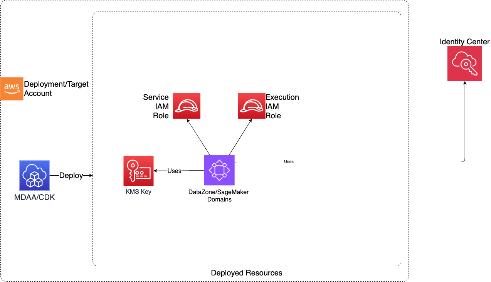

# SageMaker

The SageMaker CDK application is used to configure and deploy SageMaker Unified Studio (DataZone V2) Domains and associated resources. Note that under the hood, this module provides the same functionality as the DataZone module, with domain versions set to 'V2' and IAM Identity Center auth mode enforced.

---

## Deployed Resources and Compliance Details



- **SageMaker Domain** - A SageMaker Unified Studio (DataZone V2) Domain

- **KMS CMK** - A KMS CMK specific to each domain created

- **Domain Execution Role** - An IAM Role used by SageMaker. This role is specific to the domain.

## Configuration

### MDAA Config

Add the following snippet to your mdaa.yaml under the `modules:` section of a domain/env in order to use this module:

```yaml
sagemaker: # Module Name can be customized
  module_path: '@aws-caef/sagemaker' # Must match module NPM package name
  module_configs:
    - ./sagemaker.yaml # Filename/path can be customized
```

### Module Config (./sagemaker.yaml)

[Config Schema Docs](SCHEMA.md)

```yaml
# (Optional) The arn of the KMS key used to encrypt the glue catalog in this account
# If not specified, then the role will be looked up using the standard LF settings SSM param name for datazone admin role.
glueCatalogKmsKeyArn: test-glue-catalog-key-arn
# (Optional) The role which will be used to manage LF permissions for all domains
# This should be an LF Admin role within the account, likely created by the LF Settings module
# If not specified, then the role will be looked up using the standard LF settings SSM param name for datazone admin role.
lakeformationManageAccessRole:
  arn: 'arn:test-partition:iam::test-account:role/test-role'
# List of domains to create
domains:
  # domain's name (must be unique)
  test-domain:
    # Arns for IAM roles which will be provided to the projects's resources (IE bucket)
    dataAdminRole:
      name: Admin
    # Required - Description to give to the domain
    description: DataZone Domain Description

    # Optional - How Users are assigned to domain (default: MANUAL): MANUAL | AUTOMATIC
    userAssignment: MANUAL

    # Users to be added to the domain (IAM Roles or SSO Users)
    users:
      # A friendly name for an iam user
      iam-user-name:
        # an IAM based user
        # can be referenced by arn, name, or Id
        iamRole:
          arn: role-arn
      # A friendly name for an sso user
      sso-user-name:
        ssoId: sso-user-id

    # Groups to be added to the domain (SSO only)
    groups:
      # A friendly name for an sso group
      test-sso-group1:
        ssoId: test

      test-sso-group2:
        ssoId: test2

    # List of users who will be added as owners on the root domain unit
    ownerUsers:
      - sso-user-name # Must be a named user on the domain
    # List of groups who will be added as owners on the root domain unit
    ownerGroups:
      - test-sso-group1 # Must be a named group on the domain

    # List associated accounts which will be as owners of this domain, allowing
    # creation of projects within the domain root
    ownerAccounts:
      - associated-account-name1

    # Domain units to be added to the domain
    domainUnits:
      # The domain unit name
      test-unit1:
        # List of owner users for the domain unit
        ownerUsers:
          - sso-user-name # Must be a named user on the domain
        # List associated accounts which will be as owners of this domain unit, allowing
        # creation of projects within
        ownerAccounts:
          - associated-account-name2
        # Option domain unit description
        description: testing
        # Child domain units within this domain unit
        domainUnits:
          # The child domain unit name
          test-unit2:
            # Option domain unit description
            description: testing
            # List of owner groups for this domain unit
            ownerGroups:
              - test-sso-group2 # Must be a named group on the domain

    # Optional - Additional accounts which will be associated to the domain
    associatedAccounts:
      # A friendly name for the associated account
      associated-account-name1:
        # The AWS account number fo the associated account.
        # Note, this also needs to be configured as an "additional_account" on the MDAA module within mdaa.yaml
        account: '1234567890'
        # The arn of the KMS key used to encrypt the glue catalog in this associated account
        glueCatalogKmsKeyArn: test-associated-glue-catalog-key-arn
        # Optional - If true, a domain user will be created to allow for CDK-based deployments within the associated account
        createCdkUser: true
        # (Optional) The role which will be used within the associated account to administer LF permissions.
        # This should be an LF Admin role within the account, likely created by the LF Settings module in the associated account.
        # If not specified, then the role will be looked up using the standard LF settings SSM param name for datazone admin role.
        lakeformationManageAccessRoleArn: 'arn:test-partition:iam::test-account:role/test-role'
      # A friendly name for the associated account
      associated-account-name2:
        # The AWS account number fo the associated account.
        # Note, this also needs to be configured as an "additional_account" on the MDAA module within mdaa.yaml
        account: '2234567890'
        # The arn of the KMS key used to encrypt the glue catalog in this associated account
        glueCatalogKmsKeyArn: test-associated-glue-catalog-key-arn
        # Optional - If true, a domain user will be created to allow for CDK-based deployments within the associated account
        createCdkUser: true
        # (Optional) The role which will be used within the associated account to administer LF permissions.
        # This should be an LF Admin role within the account, likely created by the LF Settings module in the associated account.
        # If not specified, then the role will be looked up using the standard LF settings SSM param name for datazone admin role.
        lakeformationManageAccessRoleArn: 'arn:test-partition:iam::test-account:role/test-role'
```
