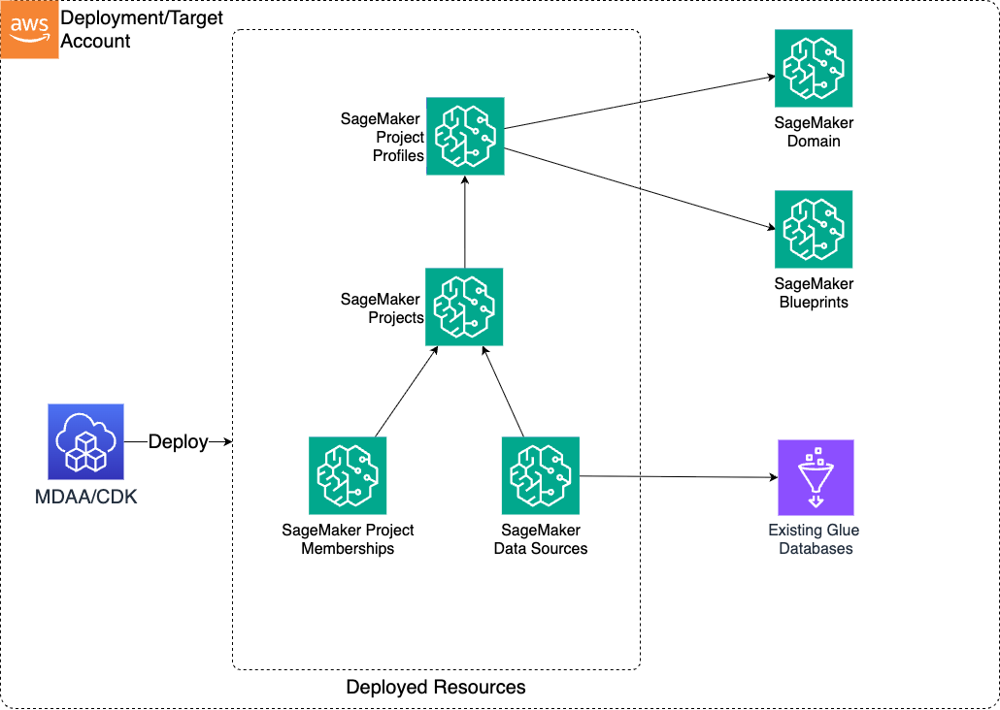

# SageMaker Project

The SageMaker Project CDK application is used to configure and deploy SageMaker Unified Studio (DataZone V2) Projects and associated resources.

Note, SageMaker Projects can also be deployed via the [DataOps Project module](../../dataops/dataops-project-app/README.md), allowing for automatic registration of Glue-based Data Sources and discovery of data assets. This module can be used when all data assets will be created/consumed entirely within SageMaker.

---

## Deployed Resources and Compliance Details



- **Project Profiles** - Enables blueprints for use in projects.

- **Project** - A SageMaker Unified Studio (DataZone V2) Project

- **Data Sources** - Allows importing of existing Glue databases as data sources into SageMaker for publishing

## Configuration

### MDAA Config

Add the following snippet to your mdaa.yaml under the `modules:` section of a domain/env in order to use this module:

```yaml
sagemaker: # Module Name can be customized
  module_path: '@aws-mdaa/sagemake-project' # Must match module NPM package name
  module_configs:
    - ./sagemaker-project.yaml # Filename/path can be customized
```

### Module Config (./sagemaker-project.yaml)

[Config Schema Docs](SCHEMA.md)

```yaml
# Recommended - SSM Param base name for the SageMaker Domain config parameters
# This will allow all required domain configuration to be pulled from SSM and APIs.
# If this is not specified, then the full domainConfig object must be specified.
domainConfigSSMParam: /test-org/test-domain/test-module/domain/test-sus-domain/config

# Environment templates which can be used by Project Profiles
projectProfileEnvironmentsTemplates:
  test-template: {}

# Project Profiles to be created in the domain
projectProfiles:
  # Unique name for the project profile. Must be unique within the domain.
  test-profie:
    # Optional - The environment template to be used for the project profile.
    # The environments from the template will be merged with the environments object below.
    environmentsTemplate: test-template
    # The environments to be deployed for the project profile.
    environments: {}

# The projects to be created in the domain
projects:
  # The project name. Must be unique within the config.
  test-sus-project:
    # The name of the project profile to be used to create the project.
    # Note, the project profile must be targetted to the same account as the project.
    profileName: test-profile
    # Optional - The domain unit within which the project will be created in the domain
    domainUnit: /some/domain/unit
    # Optional - Data Sources which will be created in the project.
    # These can be used to import existing Glue databases into SageMaker projects.
    dataSources:
      # Data source name
      test-source:
        # The glue database which will be the data source.
        databaseName: test-database-name
```
