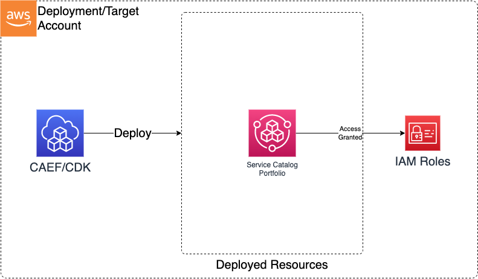

# Service Catalog

> **Note:** This documentation is also available in a rendered format [here](https://aws.github.io/modern-data-architecture-accelerator/packages/apps/governance/service-catalog-app/index.html).

Deploys AWS Service Catalog portfolios with IAM principal associations, enabling governed self-service provisioning of approved products within a data environment. Use this module when you need to offer pre-approved infrastructure products to your teams through a self-service catalog with role-based access control.

---

## Deployed Resources

This module deploys and integrates the following resources:

**Service Catalog Portfolios** - Portfolios to which products can be added via the MDAA framework.

**Portfolio Principal Associations** - Associates IAM roles to portfolios for access control.

**SSM Parameters** - Portfolio ARN and ID stored in Parameter Store for cross-module reference.



---

## Related Modules

- [Roles](../roles-app/README.md) — Create IAM roles that can be associated as portfolio principals
- [SageMaker Notebooks](../../ai/sm-notebook-app/README.md) — Notebook instances can be offered as Service Catalog products for self-service provisioning

---

## Security/Compliance Details

This module is designed in alignment with MDAA security/compliance principles and CDK nag rulesets. Additional review is recommended prior to production deployment, ensuring organization-specific compliance requirements are met.

- **Least Privilege**:
  - Portfolio access granted through explicit IAM role associations
  - Only associated principals can browse and launch products from the portfolio

---

## Configuration

### MDAA Config

Add the following snippet to your mdaa.yaml under the `modules:` section of a domain/env in order to use this module:

```yaml
service-catalog: # Module Name can be customized
  module_path: '@aws-mdaa/service-catalog' # Must match module NPM package name
  module_configs:
    - ./service-catalog.yaml # Filename/path can be customized
```

### Module Config Samples and Variants

Copy the contents of the relevant sample config below into the `./service-catalog.yaml` file referenced in the MDAA config snippet above.

#### Minimal Configuration

Required properties only — a single portfolio with a provider name. Start here for a basic Service Catalog portfolio that products can be added to later.

[sample-config-minimal.yaml](sample_configs/sample-config-minimal.yaml)

```yaml
--8<-- "sample_configs/sample-config-minimal.yaml"
```

#### Comprehensive Configuration

Provisions Service Catalog portfolios with provider details, access controls, and tag options for governed self-service infrastructure deployment. Start here when evaluating all available options for portfolio configuration, principal associations, and tag-based governance.

[sample-config-comprehensive.yaml](sample_configs/sample-config-comprehensive.yaml)

```yaml
--8<-- "sample_configs/sample-config-comprehensive.yaml"
```

---

[Config Schema Docs](SCHEMA.md)
