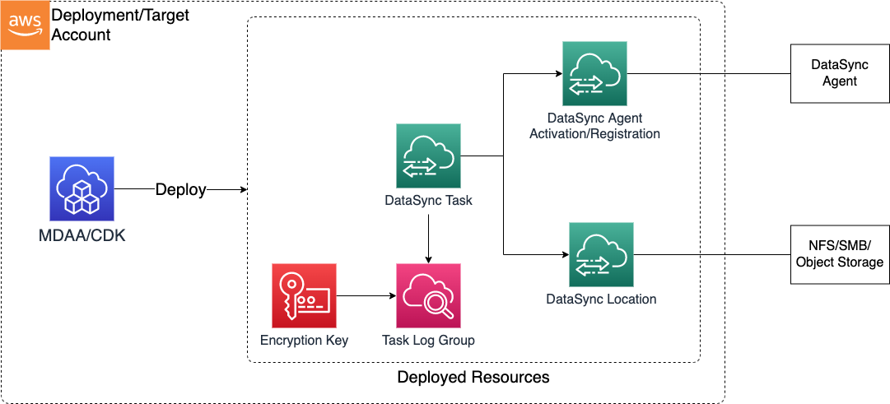
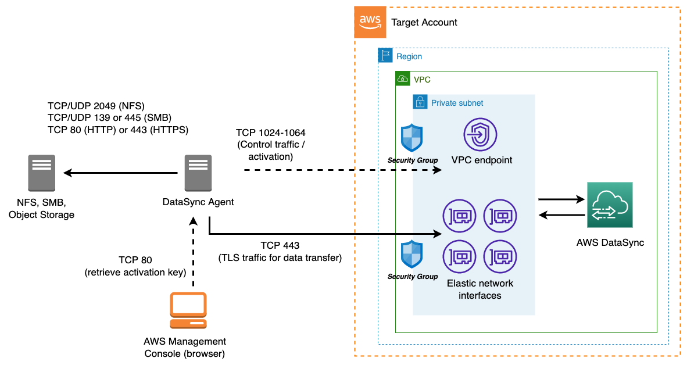
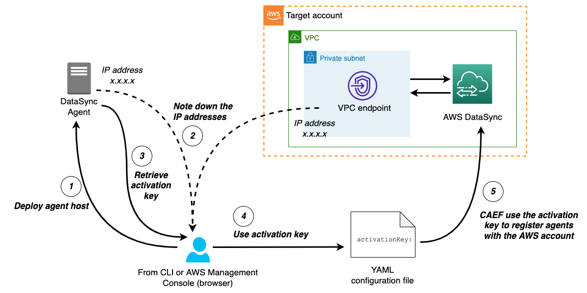

# DataSync

> **Note:** This documentation is also available in a rendered format [here](https://aws.github.io/modern-data-architecture-accelerator/packages/apps/utility/datasync-app/index.html).

Deploys AWS DataSync agents, storage locations (S3, NFS, SMB, Object Storage), and transfer tasks for automated data movement between on-premises and AWS storage services, or between AWS storage services. Common scenarios include migrating large datasets from on-premises NFS or SMB shares to S3, synchronizing data between AWS regions, or scheduling recurring transfers from network-attached storage into your data lake.

---

## Deployed Resources

This module deploys and integrates the following resources:

- **DataSync Agent Activation**: Registers agents with your AWS account. Agents read/write data at on-premises locations. Deploy multiple agents in different AZs/subnets for resiliency. Agents must be deployed before activation — refer to [AWS DataSync agent requirements](https://docs.aws.amazon.com/datasync/latest/userguide/agent-requirements.html).
- **DataSync Locations**: Endpoints for tasks. Supports S3, NFS, SMB, and Object Storage (cloud-based) location types. Locations requiring credentials (SMB, Object Storage) must have credentials pre-stored in Secrets Manager.
- **DataSync Tasks**: Configurations for data transfer and synchronization between two locations, with scheduling, filtering, and transfer options.
- **EC2 Security Group**: Security group for DataSync agent-to-service data transfer.
- **KMS Encryption Key**: Encrypts DataSync execution logs.
- **CloudWatch Log Group**: Task execution logging.



## DataSync Deployment Architecture



---

## Related Modules

- [Data Lake](../../datalake/datalake-app/README.md) — DataSync can transfer data to and from data lake S3 buckets
- [SFTP Server](../sftp-server-app/README.md) — Deploy an SFTP server as an alternative ingestion method for data transfer
- [Roles](../../governance/roles-app/README.md) — Create IAM roles for DataSync S3 location access

---

## Security/Compliance Details

This module is designed in alignment with MDAA security/compliance principles and CDK nag rulesets. Additional review is recommended prior to production deployment, ensuring organization-specific compliance requirements are met.

- **Encryption at Rest**:
  - DataSync task execution logs encrypted with customer-managed KMS key
  - S3 locations use IAM role-based access with bucket encryption
- **Encryption in Transit**:
  - DataSync transfers data over TLS
- **Least Privilege**:
  - S3 locations use dedicated IAM roles with scoped bucket access
  - SMB and Object Storage credentials stored in Secrets Manager
  - Agent activation keys are time-limited (30 minutes)
- **Network Isolation**:
  - Agents connect via VPC endpoints (PrivateLink)
  - Security group controls ENI traffic for data transfer (port 443) and control traffic (TCP 1024-1064)
  - No public internet access required

---

## AWS Service Endpoints

The following VPC endpoints may be required if public AWS service endpoint connectivity is unavailable (e.g., private subnets without NAT gateway, firewalled environments, or PrivateLink-only architectures):

| AWS Service     | Endpoint Service Name                   | Type      |
| --------------- | --------------------------------------- | --------- |
| DataSync        | `com.amazonaws.{region}.datasync`       | Interface |
| KMS             | `com.amazonaws.{region}.kms`            | Interface |
| S3              | `com.amazonaws.{region}.s3`             | Gateway   |
| CloudWatch Logs | `com.amazonaws.{region}.logs`           | Interface |
| Secrets Manager | `com.amazonaws.{region}.secretsmanager` | Interface |
| STS             | `com.amazonaws.{region}.sts`            | Interface |
| EC2             | `com.amazonaws.{region}.ec2`            | Interface |

---

## Prerequisite and Pre-deployment Tasks

### Prerequisite

- VPC Endpoint for DataSync service. The security group of the VPC Endpoint must allow control traffic from the DataSync agent on TCP port range 1024-1064. Refer to [Network requirements for VPC endpoints](https://docs.aws.amazon.com/datasync/latest/userguide/datasync-network.html#using-vpc-endpoint) for detail network requirement.
- A security group for DataSync tasks. When DataSync tasks are running, DataSync agents will transfer data to DataSync service via ENIs on TLS traffic port 443. The security group must allow TCP inbound traffic on port 443 from the agent hosts.
- For SMB and cloud-based storage location types, a secret in Secrets Manager is needed to store credentials. The secret must contain values in below format:
  - For SMB location: {user:< username >,password:< pwd >}
  - For cloud-based object storage: {"accessKey":< access_key >","secretKey":"< secret_key >"}

Note: If you want MDAA to handle the above security group requirement, two-stage deployment is required.

1. Put the information in the _connection:_ section. Put the _agents:_ configuration but do not specify _activationKey:_ parameter in the agent configuration (Refer to the example for _agent1:_ further below.)
2. Run the first pass MDAA deployment. MDAA will deploy the security group and required ingress rules.
3. Retrieve the agent activation key(s) and put in the _agents:_ configuration, one for each agent.
4. Run the second pass MDAA deployment. MDAA will register the agent(s) and other DataSync resources.

### Pre-deployment Tasks

This process must be completed prior to DataSync deployment using MDAA.



1. Deploy DataSync agent in the platform of choice. You may deploy it on EC2 using DataSync AMI or another hypervisor platform. Refer to [Deploy your AWS DataSync agent](https://docs.aws.amazon.com/datasync/latest/userguide/deploy-agents.html) for detail guideline.

2. Gather information that will be needed to retrieve the agent activation key in the next step:
   - The IP address of the DataSync Agent host (deployed in step 1)
   - The IP address of the VPC Endpoint for DataSync service

3. Retrieve agent activation key from a host or workstation with connectivity to the DataSync agent on port 80. The activation key can be retrieved using CLI or AWS Management Console.
   - Using CLI:
     `curl "http://<agent-ip-address>/?gatewayType=SYNC&activationRegion=<aws-region>&privateLinkEndpoint=<IP address from the same subnet/AZ of VPC endpoint>&endpointType=PRIVATE_LINK&no_redirect"`

     Refer to the step 4 of [Creating an AWS DataSync agent with the AWS CLI](https://docs.aws.amazon.com/datasync/latest/userguide/create-agent-cli.html) for more information.

   - Using AWS Management Console: follow the step 1 & 2 in [Activate your AWS DataSync agent](https://docs.aws.amazon.com/datasync/latest/userguide/activate-agent.html).

4. Put the activation key retrieved in the previous step into the `activationKey` parameter of the DataSync module configuration file.

---

## Configuration

### MDAA Config

Add the following snippet to your mdaa.yaml under the `modules:` section of a domain/env in order to use this module:

```yaml
datasync: # Module Name can be customized
  module_path: '@aws-mdaa/datasync' # Must match module NPM package name
  module_configs:
    - ./datasync.yaml # Filename/path can be customized
```

### Module Config Samples and Variants

Copy the contents of the relevant sample config below into the `./datasync.yaml` file referenced in the MDAA config snippet above.

#### Minimal Configuration

Deploys VPC networking, an agent, two S3 locations, and a transfer task between them. Start here for a basic S3-to-S3 data transfer setup with a single agent.

[sample-config-minimal.yaml](sample_configs/sample-config-minimal.yaml)

```yaml
# Contents available via above link
--8<-- "target/docs/packages/apps/utility/datasync-app/sample_configs/sample-config-minimal.yaml"
```

#### Comprehensive Configuration

Transfers data between on-premises storage and AWS using DataSync agents, locations (S3, SMB, NFS, object storage), and tasks with scheduling, filtering, and transfer options. Start here when evaluating all available options for location types, multi-agent resiliency, scheduling, and transfer filtering.

[sample-config-comprehensive.yaml](sample_configs/sample-config-comprehensive.yaml)

```yaml
# Contents available via above link
--8<-- "target/docs/packages/apps/utility/datasync-app/sample_configs/sample-config-comprehensive.yaml"
```

---

[Config Schema Docs](SCHEMA.md)
