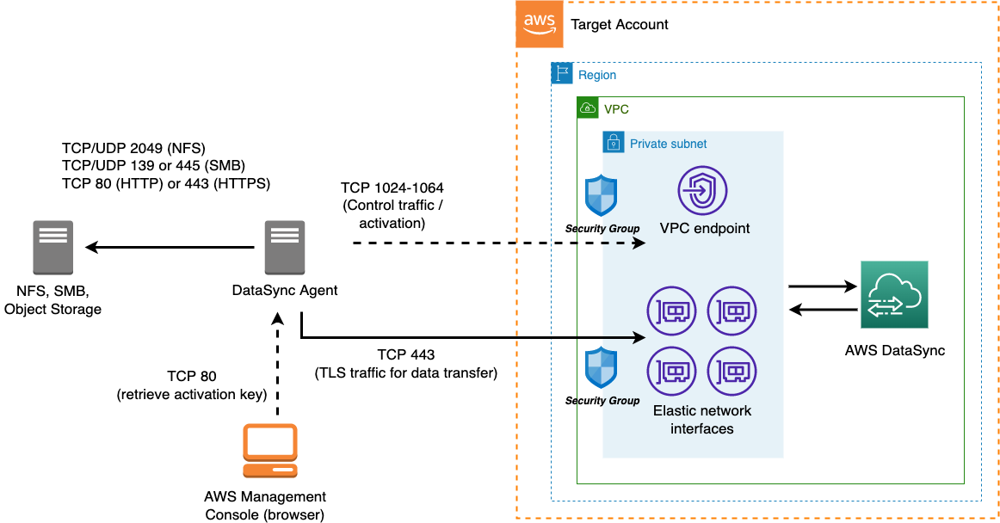
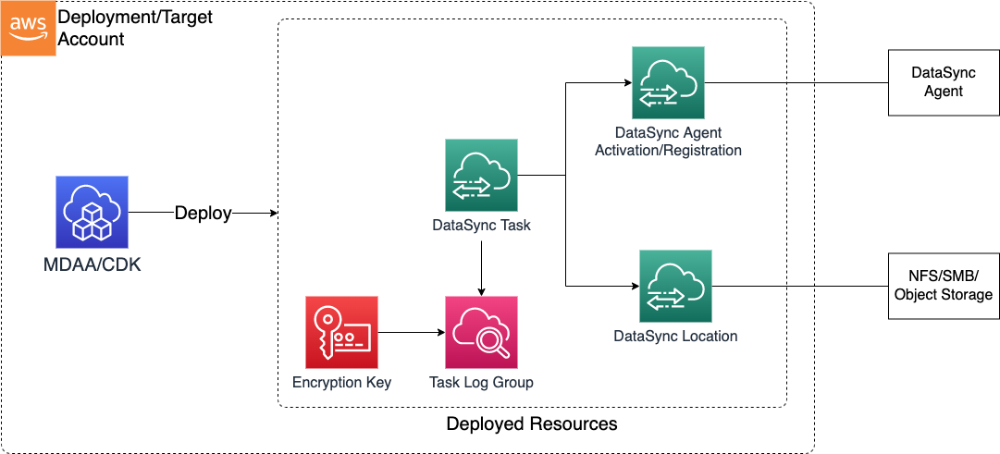
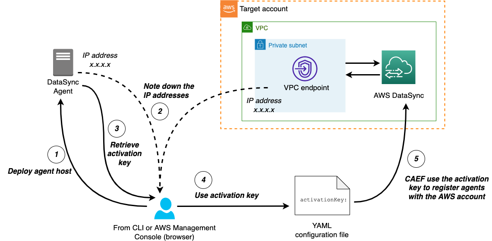

# DataSync

AWS DataSync is an online data transfer service that simplifies, automates, and accelerates moving data between on-premises storage systems and AWS Storage services, as well as between AWS Storage services.

## DataSync Deployment Architecture



***

## Deployed Resources and Compliance Details



**DataSync Agent Activation** - An agent activation step will register the agent with your AWS account.

* Agents read data from or write to your on-premises locations.
* Deploy multiple agents in different AZs/subnets to provide resiliency.
* DataSync agent must be deployed before the agent activation step can be done. Refer to [AWS DataSync agent requirements](https://docs.aws.amazon.com/datasync/latest/userguide/agent-requirements.html) for agent deployment and configuration.

**DataSync Location** - Locations are endpoints for tasks, such as an on-premises file system or cloud-based storage service.

* Currently, four types of storage are supported; NFS, SMB, S3, and object storage (cloud-based storage).
* Any location type which requires username/password credentials (SMB, Object Storage) must first have these credentials stored in a Secret, created and managed outside of CAEF

**DataSync Task** - Tasks are configurations for data transfer and synchronization between two locations.

***

## Prerequisite and Pre-deployment Tasks

### Prerequisite

* VPC Endpoint for DataSync service. The security group of the VPC Endpoint must allow control traffic from the DataSync agent on TCP port range 1024-1064. Refer to [Network requirements for VPC endpoints](https://docs.aws.amazon.com/datasync/latest/userguide/datasync-network.html#using-vpc-endpoint) for detail network requirement.
* A security group for DataSync tasks. When DataSync tasks are running, DataSync agents will transfer data to DataSync service via ENIs on TLS traffic port 443. The security group must allow TCP inbound traffic on port 443 from the agent hosts.
* For SMB and cloud-based storage location types, a secret in Secrets Manager is needed to store credentials. The secret must contain values in below format:
  * For SMB location: {user:< username >,password:< pwd >}
  * For cloud-based object storage: {"accessKey":< access_key >","secretKey":"< secret_key >"}

Note: If you want CAEF to handle the above security group requirement, two-stage deployment is required.

1. Put the information in the *connection:* section. Put the *agents:* configuration but do not specify *activationKey:* parameter in the agent configuration (Refer to the example for *agent1:* further below.)
2. Run the first pass CAEF deployment. CAEF will deploy the security group and required ingress rules.
3. Retrieve the agent activation key(s) and put in the *agents:* configuration, one for each agent.
4. Run the second pass CAEF deployment. CAEF will register the agent(s) and other DataSync resources.

### Pre-deployment Tasks

This process must be completed prior to DataSync deployment using CAEF.



1. Deploy DataSync agent in the platform of choice. You may deploy it on EC2 using DataSync AMI or another hypervisor platform. Refer to [Deploy your AWS DataSync agent](https://docs.aws.amazon.com/datasync/latest/userguide/deploy-agents.html) for detail guideline.

2. Gather information that will be needed to retrieve the agent activation key in the next step:
   * The IP address of the DataSync Agent host (deployed in step 1)
   * The IP address of the VPC Endpoint for DataSync service

3. Retrieve agent activation key from a host or workstation with connectivity to the DataSync agent on port 80. The activation key can be retrieved using CLI or AWS Management Console.

   * Using CLI:
     `curl "http://<agent-ip-address>/?gatewayType=SYNC&activationRegion=<aws-region>&privateLinkEndpoint=<IP address from the same subnet/AZ of VPC endpoint>&endpointType=PRIVATE_LINK&no_redirect"`

     Refer to the step 4 of [Creating an AWS DataSync agent with the AWS CLI](https://docs.aws.amazon.com/datasync/latest/userguide/create-agent-cli.html) for more information.

   * Using AWS Management Console: follow the step 1 & 2 in [Activate your AWS DataSync agent](https://docs.aws.amazon.com/datasync/latest/userguide/activate-agent.html).

4. Put the activation key retrieved in the previous step into the `activationKey` parameter of the DataSync module configuration file.

***

## Configuration

```yaml
# Information for looking up network infrastructure information
# Based on this information, CAEF will create a security group with all required ingress rules and attach to the existing VPC endpoint for datasync service
vpc:
  # The id of the VPC that DataSync service will use
  vpcId: vpc-009ce5ec1cff75fx6
  # The CIDR IP block of the VPC
  vpcCidrBlock: 10.0.0.0/8

# Specifies the agent configuration section
agents:
  # Agent name for a DataSync agent
  # In this example, the agent is configured for 1st pass, without agent activation key specified.
  agent1:
    # The id of the subnet for data transfer between the agent and task.
    subnetId: subnet-0c27f330c0ea98xx5
    # The IP address of the DataSync agent host.
    agentIpAddress: 1.1.1.1
  agent2:
    # Agent activation key can be retrieved from the AWS Management Console (please refer to [Activate your AWS DataSync agent](https://docs.aws.amazon.com/datasync/latest/userguide/activate-agent.html) for more detail) or from the CLI (refer to [Creating an AWS DataSync agent with the AWS CLI](https://docs.aws.amazon.com/datasync/latest/userguide/create-agent-cli.html) for more detail.)
    # NOTE: Agent activation key will expire in 30 minutes. A new agent activation key is needed when a previous deployment failed and rolled back and the activation key has been used.
    activationKey: XXXXX-XXXXX-XXXXX-XXXXX-XXXXX
    # The ID of the subnet that will be used for data transfer with DataSync elastic network interfaces/ENIs.
    subnetId: example-subnet    
    agentIpAddress: 1.1.1.2
  # In the example below, the security group resource is deployed outside CAEF. All below information are required.
  agent3:
    activationKey: XXXXX-YYYYY-XXXXX-YYYYY-XXXXX
    subnetId: "{{resolve:ssm:/path/to/subnet-id-ssm}}"
    vpcEndpointId: "{{resolve:ssm:/path/to/vpce-ssm}}"
    agentIpAddress: 1.1.1.3
    securityGroupId: sg-123456

# Specifies the DataSync location configuration section
locations:
  # Storage location type. Currently supports: s3 | smb | nfs | object_storage
  s3:
    # Name of DataSync location to be created
    s3location1:
      # Name of S3 bucket (may also use a dynamic reference)
      s3BucketArn: example-bucket-name1
      # The ARN of IAM role to be used by DataSync to read/write object in S3 location
      # It accepts a role ARN or a dynamic reference
      bucketAccessRoleArn: "{{resolve:ssm:/path/to/role-arn-ssm}}"
      # Optional - subdirectory location
      subdirectory: /some/prefix
    s3location2:
      s3BucketArn: example-bucket-name2
      # Optional S3 bucket prefix
      subdirectory: /some/prefix
      bucketAccessRoleArn: some-role-arn

  # Specifies SMB storage location type
  smb:
    smb-loc1:
      # The list of names of the generated DataSync agents specified in the above `agents` configuration section.
      # The list only accepts one member
      agentNames:
        - agent1
      # Name of Secrets Manager that stores credential of the user with permission to read/write to SMB volume
      # The secret must contain value in the format of {user:<username>,password:<pwd>}
      secretName: some-secret-name
      # Optional - Active Directory domain name
      domain: some-ad-domain-name
      # SMB storage server hostname or IP address
      serverHostname: some.smbserver.hostname
      subdirectory: /some/subdirectory
      # Optional - the SMB version. Valid values: AUTOMATIC (default) | SMB2 | SMB3
      smbVersion: AUTOMATIC
    smb-loc2:
      # ARN of the DataSync agent or a dynamic reference to it. Alternatively, use agentNames with referring to the generated DataSync agent name specified in the above `agents` configuration section. Use this only when the agent registration process was done outside CAEF.
      agentArns:
        - arn:{{partition}}:datasync:{{region}}:{{account}}:agent/existing-agent-id
      secretName: some-secret-name
      domain: some-ad-domain-name
      serverHostname: some.smbserver.hostname
      subdirectory: /some/subdirectory
  nfs:
    nfs_loc1:
      # The list of names of the generated DataSync agents specified in the above `agents` configuration section.
      agentNames:
        - agent1
        - agent2
      serverHostname: some.nfsserver.hostname
      subdirectory: /some/subdirectory
  # Specification name for cloud-managed storage location. Refer to [New for AWS DataSync – Move Data Between AWS and Other Public Locations](https://aws.amazon.com/blogs/aws/new-for-aws-datasync-move-data-between-aws-and-google-cloud-storage-or-aws-and-microsoft-azure-files/) for a more detail explanation.
  objectStorage:
    gcp1:
      agentNames:
        - agent1
      # Name of the cloud storage
      bucketName: some-object-storage-name
      serverHostname: some-object-storage.endpoint.hostname
      # Name of Secrets Manager that stores credential of the user with permission to read/write to the cloud-based object storage
      # The secret must contain value in the format of {"accessKey":<access_key>","secretKey":"<secret_key>"} 
      secretName: some-secret-name
      # storage port number, for example: 443
      serverPort: 443
      subdirectory: /some/prefix
      # protocol type, for example: HTTPS
      serverProtocol: HTTPS

# DataSync task configuration section
tasks:
  # Task name
  mytask1:
    # Source and destination location. In this example, they are referred to by the names specified in the agent section of the configuration file
    sourceLocationName: s3location1
    destinationLocationName: s3location2
    # The schedule to run the task
    schedule:
      scheduleExpression: cron(0 * * * ? *) # run every hour
    # DataSync Task sample options below. Refer to https://docs.aws.amazon.com/AWSCloudFormation/latest/UserGuide/aws-properties-datasync-task-options.html for complete options.
    options:
      preserveDeletedFiles: PRESERVE
      transferMode: CHANGED
    # Pattern(s) for files to include. CloudFormation will only accept 1 member in the includes list.
    includes:
      - filterType: SIMPLE_PATTERN
        value: "/data*|/ingestion*"   # Begins with / and only accepts asterisk at the most right position
  mytask2:
    # In this example, source and destination locations are specified using locations. Use this parameters only for existing locations that have been created outside CAEF. Otherwise, use sourceLocationName and destinationLocationName.
    sourceLocationArn: "{{resolve:ssm:/path/to/source/location/arn}}"
    destinationLocationArn: "{{resolve:ssm:/path/to/destination/location/arn}}"
    options:
      transferMode: CHANGED
      verifyMode: ONLY_FILES_TRANSFERRED
    # Optional - Pattern(s) for files to exclude. CloudFormation will only accept 1 member in the excludes list. Use | delimiter for multiple values.
    excludes:
      - filterType: SIMPLE_PATTERN
        value: "*.tmp|*.temp"  
```
