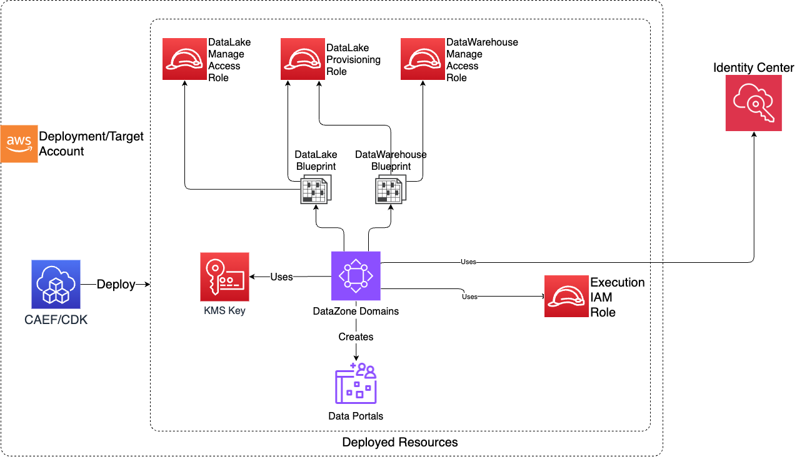

# DataZone
The DataZone CDK application is used to configure and deploy DataZone Domains and associated resources such as environment blueprints.

***

## Deployed Resources and Compliance Details




* **DataZone Domain** - A DataZone Domain

* **KMS CMK** - A KMS CMK specific to each domain created

* **Domain Execution Role** - An IAM Role used by DataZone. This role is specific to the domain.

* **Domain Provisioning Role** - An IAM Role specific to the domain deployed only when at least one blueprint is enabled. This role is used and shared among all the enabled blueprints. 

* **Data Lake Blueprint** - Data Lake Blueprint (id: DefaultDataLake) specific to each domain.

* **Data Lake Manage Access Role** - An IAM Role used by the Data Lake Blueprint and it's specific to each domain.

* **Data Warehouse Blueprint** - Data Warehouse Blueprint (id: DefaultDataWarehouse) specific to each domain.

* **Data Warehouse Manage Access Role** - An IAM Role use by the Data Warehouse blueprint and it's specific to each domain.

## Configuration

```yaml
# List of domains to create
domains:
  # domain's name (must be unique)
  test-domain:
    # Required - Description to give to the domain
    description: DataZone Domain Description

    # Optional - Type of SSO (default: DISABLED): DISABLED | IAM_IDC
    singleSignOnType: DISABLED

    # Optional - How Users are assigned to domain (default: MANUAL): MANUAL | AUTOMATIC
    userAssignment: MANUAL

    # Optional - Environment Blueprints to enable for the domain.
    # At the moment, there are 2 available blueprints `dataLake` and `dataWarehouse` and it's possible to enable either one or both of them.
    environmentBlueprints:
      dataLake:
        # Required - List of regions where the blueprint will be enabled 
        enabledRegions:
          - ca-central-1
      dataWarehouse:
        # Required - List of regions where the blueprint will be enabled
        enabledRegions:
          - ca-central-1
```
