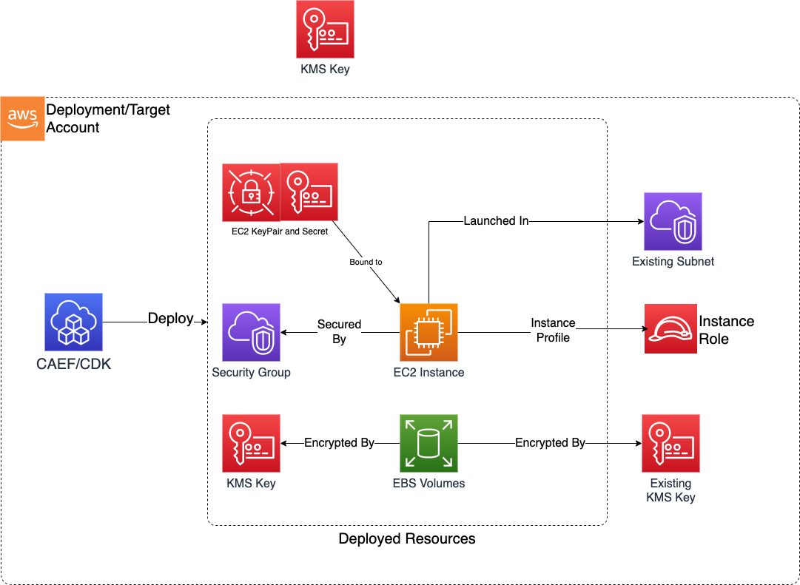

# Module Overview

The EC2 CDK application is used to configure and deploy secure EC2 instances and associated resources.

***

## Deployed Resources and Compliance Details



**KMS CMK** - Created if an existing KMS key is not provided for each instance/keypair.

* Will be used to encrypt Instance EBS volumes and KeyPair Secrets
* adminRoles will be granted admin and user permissions to the key via key policy
* Additional accesses to the key may be granted as necessary by IAM policy

**EC2 KeyPairs** - Will be created for use by EC2 Instances, with private key material stored within a Secret.

* KeyPairs and their Secrets will be retained post stack deletion
* Each KeyPair Secret will be encrypted with the module KMS CMK if an existing key is not specified

**EC2 Security Groups** - Will be used by EC2 instances to control network access. Can also be used by other modules.

* All egress will be allowed by default
* No ingress will be allowed by default

**EC2 Instances** - Secure EC2 instances.

* Instances have termination protection enabled and will be retained post stack deletion.
* Each configured EBS volume will use the module KMS CMK if an existing key is not specified
* AMI-configured volumes must be accounted for within the config, otherwise AMI deployment with unencrypted volumes will be attempted, but will fail due to additional post-deployment checks conducted by the underlying CAEF EC2 L2 construct

***

## Configuration

```yaml

# List of roles which will be granted access to the KMS key
# as well as KeyPair secrets containing private keys.
# Roles can be referenced by name, arn, or id
adminRoles:
  - name: Admin
  - arn: arn:{{partition}}:iam::{{account}}:role/some-admin-role
  - id: some-role-id

# List of EC2 KeyPairs to be created. Each keypair
# will have it's private key material stored in a Secret,
# with access granted to Admin roles.
keyPairs:
  # Each keyPair has a unique name.
  # To create a keyPair with default settings, specify
  # an empty config object '{}'
  test-key-pair: {}
  # Key pairs can also specify an existing KMS key
  test-key-pair2:
    kmsKeyArn: "arn:{{partition}}:kms:{{region}}:{{account}}:key/test-key"

# List of security groups to be created
securityGroups:
  sg1:
    vpcId: vpc-testvpc
    ingressRules:
      # Ingress from a CIDR range
      ipv4:
        - cidr: 10.0.0.0/28
          port: 443
          protocol: tcp
    egressRules:
      # Allow egress to prefixLists for gateway VPC endpoints
      prefixList:
        - prefixList: pl-4ea54027
          description: prefix list for com.amazonaws.{{region}}.dynamodb
          protocol: tcp
          port: 443
        - prefixList: pl-7da54014
          description: prefix list for com.amazonaws.{{region}}.s3
          protocol: tcp
          port: 443
      # Egress to a cidr range
      ipv4:
        - cidr: 10.0.0.0/28
          port: 443
          protocol: tcp
      # Egress to an existing Security group
      sg:
        - sgId: ssm:/ml/sm/sg/id
          port: 5472
          protocol: tcp

# List of cfn init Objects to be created
cfnInit:
#Name for cfn-init object, is free form, used to refer to init object in instance using initName prop
  initWindows:
#list of configSets created, can choose which configSets to run using initOptions prop of ec2. 
#If initOptions are not provided, default configSet is run
#Each configSet consists of list of configs to be run in that order
    configSets:
#Name of configSet
      default:
#configs prop of configset is a list of configs to be run in that order
        configs:
          - "awscli"
          - "Preinstall"
      confgiset2:
        configs:
          - "Preinstall"
          - "awscli"
#configs prop of cfnInit consist of list of configs, these configs are the ones used in configSets
    configs:
#Name of config
      awscli:
#package prop of config is a list of packages to be installed
        packages:
#identifier key of package, this is free form and can be any string
          awspackage:
#package manager to be used
# msi | rpm | python | yum | apt | gem
            packageManager: msi
#location of package
            packageLocation: "https://s3.amazonaws.com/aws-cli/AWSCLI64.msi"
          anotherpackage:
            packageManager: msi
            packageLocation: "https://s3.amazonaws.com/aws-cli/thisisanotherpackage.msi"
      Preinstall:
        packages:
          git:
            packageManager: msi
            packageLocation: "https://s3.amazonaws.com/somepackagefromconfig.msi"
# Commands section consist of list of commands, these commands are run in lexographical order of their identifier(key) name
        commands:
#Identifier(key) for the the command, commands are run in lexographical order of their identifier(key) name
          01testCommand:
#command can be either shellcommand or argvs, shellcommand is in string format, argvs in list of strings format
            shellCommand: 'echo "this is a command"'
          02anotherTestCommand:
            shellCommand: 'echo "this TOO is a command"'
#Test command is run before the command to see if command needs to be run,
# success output of test command results in skipping run of main command
            testCommand: 'echo "this is test command"'
#directory where the command needs to be run
            workingDir: '/some/dir/'
#if the command causes reboot, set waitForever to true to resume cfn-init after reboot is complete
            waitForever: true
#if command take time to run, can set waitAfterCompletion to some duration. In minutes
            # waitAfterCompletion: 4
#if command needs service restart after command has run
            restartRequired: true
#files prop to create files
        files:
#Identifier(key) for the the file, is used to name the file created.
          testfile.txt:
#path of file in source location
            filePath: './somefile.txt'
#if file needs service restart after file has been created
            restartRequired: true
#Services section consist of list of services
        services:
#name of service as used in OS
          cfn-hup:
#If service needs to be enabled
            enabled: true
#to make sure service is running
            ensureRunning: true
# to restart the service after file or package or command run.
#If any of those have restartRequired true >> have to set it true here to implement it
            restartRequired: true

  initLinux:
    configSets:
      default:
        configs:
          - "Apache"
          - "Prereq"
      confgiset2:
        configs:
          - "Prereq"
          - "Apache"
    configs:
      Prereq:
        packages:
          git:
            packageManager: yum
            packageName: git
            packageVersions: []
          rpmpackage:
            packageManager: rpm
            packageLocation: "https://s3.amazonaws.com/aws-cli/rpmpackage.rpm"
          jqpackage:
            packageManager: yum
            packageName: jq
            packageVersions: []
      Apache:
        packages:
          apachepackage:
            packageManager: yum
            packageName: httpd
            packageVersions: []

# List of ec2 instances to be created
instances:
  # Each instance is uniquely named within the config
  instance-1:
    securityGroup: sg1 # Name of securityGroup from 'securityGroups` section of config
    # VPC/AZ configuration for the instance
    vpcId: vpc-testvpc
    subnetId: subnet-testsubnet
    availabilityZone: "{{region}}a"
    # Type of the instance
    instanceType: t3.medium
    # AMI of the instance
    amiId: ami-linux
    # Role which will be used as Instance Profile
    # Role can be referenced using arn, name, or id
    instanceRole:
      arn: arn:{{partition}}:iam::{{account}}:role/instance-role
    # Instance storage config
    # Note that if deploying an unencrypted AMI,
    # you MUST specify the AMI's root volume deviceName
    # in at least one blockDevice below to
    # ensure that the root volume is encrypted
    blockDevices:
      - deviceName: "/dev/sda1"
        volumeSizeInGb: 32
        ebsType: gp3
    # Indicates which os will run on the instance
    # 'linux' | 'windows' | 'unknown'
    osType: linux
    # Optional - path to local user data script relative to this config
    userDataScriptPath: "./userdata.sh"
    # The name of a key pair created by the 'keyPairs' section of this config
    keyPairName: test-key-pair
    # The name of a init configuration to be applied to this instance, name is referred from initMap section
    initName: initLinux

  instance-2:
    securityGroupId: sg-123412412 # ID of an existing security group created outside of this config
    vpcId: vpc-testvpc
    subnetId: subnet-testsubnet
    instanceType: t3.medium
    availabilityZone: "{{region}}b"
    amiId: ami-windows
    instanceRole:
      name: some-instance-role-name
    blockDevices:
      - deviceName: "/dev/sda1"
        volumeSizeInGb: 32
        ebsType: gp3
      - deviceName: "/dev/sdb1"
        volumeSizeInGb: 16
        ebsType: gp2
    kmsKeyArn: "arn:{{partition}}:kms:{{region}}:{{account}}:key/test-key"
    osType: windows
    userDataScriptPath: "./userdata.ps1"
    # Name of an existing key pair created outside of this config
    existingKeyPairName: "rsa-key"
    initName: initWindows


```
