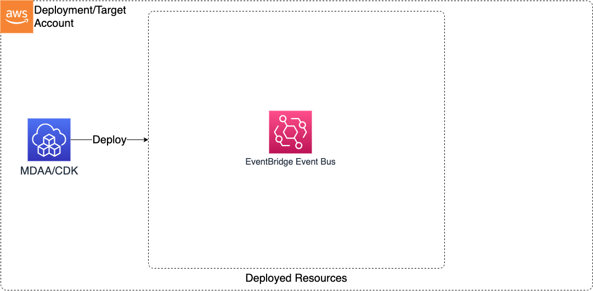

# Module Overview

This EventBridge CDK application is used to configure deploy EventBridge resources
***

## Deployed Resources and Compliance Details



**EventBridge Custom Event Bus** - Custom EventBridge Event Buses
  
* Each EventBus can optionally be configured with a set of principals which will be provided bus access via resource policy
* Event archive is automatically created for each event bus, with a configurable retention period

## Configuration

```yaml
# List of event buses to be created
eventBuses:
  # The event bus name (must be unique)
  test-event-bus:
    # Optional - the number of days for which events will be archived
    archiveRetention: 100
    # Optional - the list of principals (arn or service-based) which will be granted PutEvent access
    # to the event bus
    principals:
      - arn: some-arn
      - service: some-service.amazonaws.com
```
