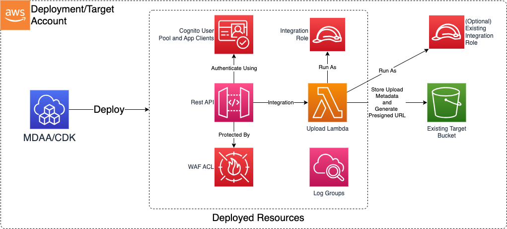

# Machine to Machine App

The Machine to Machine CDK app is used to deploy a rest API which can be used to interact with the data lake.

## Deployed Resources



* **API Gateway REST API** - A REST API which can be used to interact with a Data Lake.
* **Cognito User Pool** - Manages client app credentials for access to the API.
* **WAF WebACL** - Further restricts access to the API to a list of authorized CIDR blocks.

***

## Configuration

### Sample App Config Contents

```yaml
api:
  # List of admin roles which will be granted admin access to generated resources
  # (currently KMS key)
  adminRoles:
    - id: test-admin-role-id
  # The target bucket against which API interactions will be executed
  targetBucketName: landing-bucket-name
  # The target prefix in the target bucket
  targetPrefix: testing
  # (Optional) The target prefix for metadata in the target bucket.
  # If not specified, will default to targetPrefix
  metadataTargetPrefix: metadata-testing
  # The reserved concurrency limit for the Lambda which executes the API actions
  concurrencyLimit: 10
  # Additional WAF ACL arns which will be applied to the API Gateway.
  # A default WAF is always generated which applies default deny IP address filtering.
  wafArns:
    test-waf: test-waf-arn
  # The list of allowed IPV4 CIDR ranges which will be permitted access to the API.
  # All other requests will be denied.
  allowedCidrs:
    - 10.0.0.0/8
    - 192.168.0.0/16
    - 172.16.0.0/12
  # (Optional) This role will be used to execute the API integration Lambdas
  # If not specified, one will be created automatically.
  integrationLambdaRoleArn: arn:aws:iam::test-account:role/some-lambda-role-arn

  # (Optional) List of app clients to be added to the Cognito User Pool
  # A Client ID and Secret will be generated for each.
  appClients:
    test-client:
      # (Optional) The validity period of the ID Token in minutes (default 60 minutes).
      # Valid values are between 5 minutes and 1 day
      idTokenValidityMinutes: 60
      #  (Optional) The validity period of the Refresh Token in hours (default 30 days).
      #  Valid values between 60 minutes and 10 years
      refreshTokenValidityHours: 24
      # (Optional) The validity period of the Access Token in minutes (default 60 minutes).
      # Valid values are between 5 minutes and 1 day
      accessTokenValidityMinutes: 24

  # (Optional) Map of accepted request parameter names to boolean indicating if they are required.
  # If specified, API gateway will validate that: 1) each provided parameter is accepted;
  # and 2) all required parameters have been provided.
  requestParameters:
    test_required_param: true
    test_opt_param: false

  # (Optional) Mapping of input event fields to metadata fields written to S3.
  # (The input event is that provided from the API to the Lambda Function)
  eventMetadataMappings:
    Resource: resource
    Host: headers.Host
    UserAgent: headers.User-Agent
    IPForwarding: headers.X-Forwarded-For
    RequestTime: requestContext.requestTime
    queryStringParameters: queryStringParameters
```
