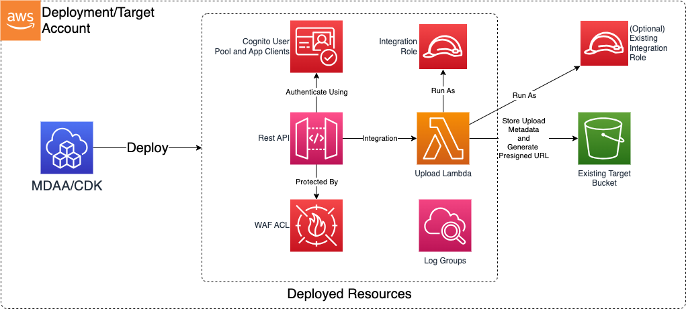

# Machine to Machine API

> **Note:** This documentation is also available in a rendered format [here](https://aws.github.io/modern-data-architecture-accelerator/packages/apps/utility/m2m-api-app/index.html).

Deploys a secure REST API via Amazon API Gateway for machine-to-machine interaction with a data lake, with Cognito-based client authentication, WAF IP filtering, and Lambda-backed integrations. Use this module when you need to provide external applications or partner systems with authenticated, IP-restricted programmatic access to data in your data lake.

---

## Deployed Resources

This module deploys and integrates the following resources:

- **API Gateway REST API**: REST API for programmatic data lake interaction with request validation and stage configuration
- **Cognito User Pool**: Manages client app credentials (client ID/secret) for API authentication with configurable token validity
- **WAF WebACL**: IP-based access filtering restricting API access to authorized CIDR blocks. Additional WAF ACLs can be attached.
- **Lambda Functions**: API handler functions executing data operations against the target S3 bucket with configurable concurrency limits
- **KMS Encryption Key**: Encrypts API and Cognito resources
- **CloudWatch Log Groups**: API Gateway access logs and Lambda execution logs



---

## Related Modules

- [Data Lake](../../datalake/datalake-app/README.md) — Deploy data lake S3 buckets that the M2M API provides programmatic access to
- [Roles](../../governance/roles-app/README.md) — Create IAM roles for API client authentication or Lambda execution

---

## Security/Compliance Details

This module is designed in alignment with MDAA security/compliance principles and CDK nag rulesets. Additional review is recommended prior to production deployment, ensuring organization-specific compliance requirements are met.

- **Encryption at Rest**:
  - KMS encryption for API and Cognito resources
- **Encryption in Transit**:
  - All data in transit over HTTPS
- **Least Privilege**:
  - Cognito User Pool provides OAuth2 client credentials flow
  - App clients have configurable token validity periods
  - Lambda execution role follows least-privilege with scoped S3 access
- **Network Isolation**:
  - WAF WebACL applies IP-based access control with default-deny
  - Only explicitly allowed CIDR ranges can reach the API

---

## Configuration

### MDAA Config

Add the following snippet to your mdaa.yaml under the `modules:` section of a domain/env in order to use this module:

```yaml
m2m-api: # Module Name can be customized
  module_path: '@aws-mdaa/m2m-api' # Must match module NPM package name
  module_configs:
    - ./m2m-api.yaml # Filename/path can be customized
```

### Module Config Samples and Variants

Copy the contents of the relevant sample config below into the `./m2m-api.yaml` file referenced in the MDAA config snippet above.

#### Minimal Configuration

Deploys an API Gateway with Cognito client credentials authentication, WAF protection, CIDR-based access control, and Lambda integration for secure machine-to-machine data lake access via REST API. Start here for a basic M2M API with a single client and IP-restricted access to a data lake bucket.

[sample-config-minimal.yaml](sample_configs/sample-config-minimal.yaml)

```yaml
# Contents available via above link
--8<-- "target/docs/packages/apps/utility/m2m-api-app/sample_configs/sample-config-minimal.yaml"
```

#### Comprehensive Configuration

Deploys an API Gateway with Cognito client credentials authentication, WAF protection, CIDR-based access control, and Lambda integration for secure machine-to-machine data lake access via REST API. Start here when evaluating all available options for multiple clients, token validity, WAF rules, and Lambda concurrency settings.

[sample-config-comprehensive.yaml](sample_configs/sample-config-comprehensive.yaml)

```yaml
# Contents available via above link
--8<-- "target/docs/packages/apps/utility/m2m-api-app/sample_configs/sample-config-comprehensive.yaml"
```

---

[Config Schema Docs](SCHEMA.md)
