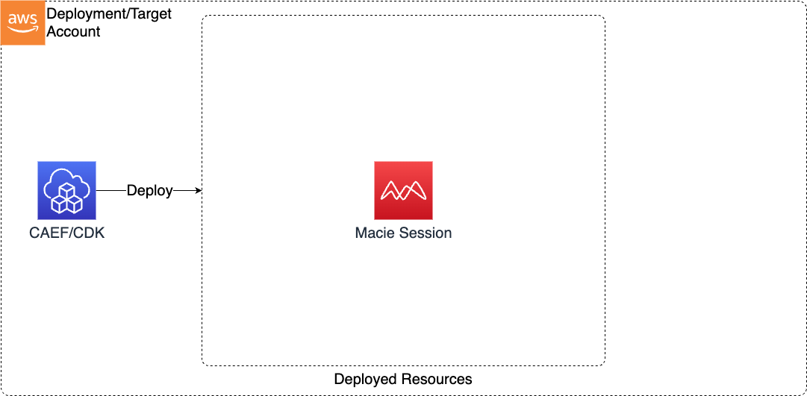

# Macie Session

This Macie Session CDK application is used to configure a the session account wise.

***

## Deployed Resources and Compliance Details


## Configuration
```yaml
# Configuration of Macie Session
session:
  # Frequency at which macie will publish updates
  # Possible values: FIFTEEN_MINUTES | ONE_HOUR | SIX_HOURS
  findingPublishingFrequency: SIX_HOURS
  # Optional - Status of Macie
  # Possible values (Default: ENABLED): ENABLED | PAUSED
  status: ENABLED
```
