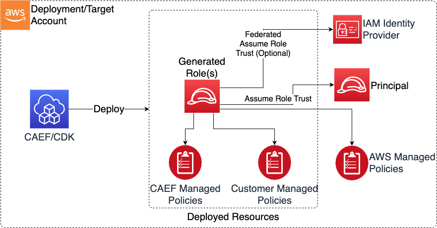

# IAM Roles and Policies

The Roles CDK application is used to deploy IAM roles which can be used within a broader data environment.

## Deployed Resources and Compliance Details



**IAM Managed Policies** - An IAM Managed Policy will be created for each policy specified in the config.

* Policies which violate CDK Nag rule sets will require explicit suppressions

**IAM Roles** - An IAM role will be created for each role specified in the config.

* Roles can have one or more assume role trust policy statements

**IAM Identity (Federation) Providers** - IAM identity providers which can be used to establish SAML federation (via assume role trust) into generated roles

* New federation providers can be created by providing the SAML metadata XML document

***

## Configuration

```yaml
# Used to configure SAML federations
federations:
  existing-federation: # Should be descriptive and unique
    # This is the arn of an existing IAM Identity Provider
    providerArn: arn:{{partition}}:iam::{{account}}:saml-provider/ExampleIdentityProvider
  new-federation: # Should be descriptive and unique
    # Path to a Saml Metadata Doc, which will be used to create
    # a SAML Identity Provider in IAM. Relative paths should be prefixed with a "./"
    samlDoc: ./path/to/samlMetaDoc.xml

# Generate Managed Policies. These Managed Policies can be 
generatePolicies:
  TestPolicy:
    policyDocument:
      Statement:
        - SID: testing
          Effect: Allow
          Resource: 
            - "arn:{{partition}}:s3:::*"
          Action:
            - s3:List*
            - s3:GetBucket*
    suppressions:
      - id: "AwsSolutions-IAM5"
        reason: "Wildcard testing ok!"
  VerbatimPolicy:
    # If specified, the policy name will be created verbatim (Ie "VerbatimPolicy" )
    # Otherwise the policy name will be generated using the naming module and above policy object name ("VerbatimPolicy")
    verbatimPolicyName: true
    policyDocument:
      Statement:
        - SID: testing
          Effect: Allow
          Resource: 
            - "arn:{{partition}}:s3:::*"
          Action:
            - s3:List*
            - s3:GetBucket*
    suppressions:
      - id: "AwsSolutions-IAM5"
        reason: "Wildcard testing ok!"
# The list of roles which will be generated
generateRoles:
  test-role:
    # By trusting 'this_account', AssumeRoleTrust will be established with IAM root of this account
    trustedPrincipal: this_account
    # List of AWS managed policies (by policy name)
    awsManagedPolicies:
      - service-role/AWSLambdaBasicExecutionRole
    # List of existing customer managed policies (by policy name)
    customerManagedPolicies:
      - SomeExistingPolicyName
    # List of policies generated in the generatePolicies section of the config (by config name)
    generatedPolicies:
      - TestPolicy
    suppressions:
      - id: "AwsSolutions-IAM4"
        reason: "AWSLambdaBasicExecutionRole approved for use"
  glue-role:
    trustedPrincipal: service:glue.amazonaws.com
    awsManagedPolicies:
      - service-role/AWSGlueServiceRole
    suppressions:
      - id: "AwsSolutions-IAM4"
        reason: "AWSGlueServiceRole approved for use"
  # An example role which uses SAML federation
  data-scientist:
    trustedPrincipal: federation:example-federation
    generatedPolicies:
      - TestPolicy

  # An example role which will be assumable by another role, such as
  # the role being used by an application.
  application_data_role1:
    trustedPrincipal: arn:{{partition}}:iam::{{account}}:role/test-application-role
    generatedPolicies:
      - TestPolicy

  # An example role which will be assumable by another role, such as
  # the role being used by an application.
  application_data_role2:
    trustedPrincipal: this_account
    assumeRoleTrustConditions:
      StringEquals:
        aws:PrincipalArn: arn:{{partition}}:iam::{{account}}:role/test-application-role
    generatedPolicies:
      - TestPolicy

  # An example role which will be assumable by multple services
  multiple_service_role:
    trustedPrincipal: service:sagemaker.amazonaws.com
    additionalTrustedPrincipals:
      - trustedPrincipal: service:sagemaker.amazonaws.com
        additionalTrustedActions: ["sts:SetSourceIdentity"]
      - trustedPrincipal: service:elasticmapreduce.amazonaws.com
        additionalTrustedActions: ["sts:SetSourceIdentity"]
    generatedPolicies:
      - TestPolicy
```
