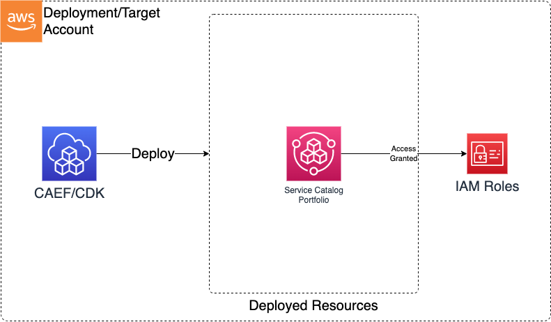

# Module Overview

The ServiceCatalog CDK application is used to deploy Service Catalog resources which can be used within a broader data environment.

## Deployed Resources and Compliance Details



**Service Catalog Portfolios** - Portfolios to which products can be added via the CAEF framework.

**Portfolio Principal Association** - Associates IAM Roles to a portfolio

***

## Configuration

```yaml
# List of portfolios to be created
portfolios:
  #The portfolio name
  TestPortfolio:
    # The provider Name
    providerName: "test-provider"
    # Option portfolio description
    description: "testing description"
    # List of role references to which portfolio access will be granted
    access:
      - name: Admin
```
