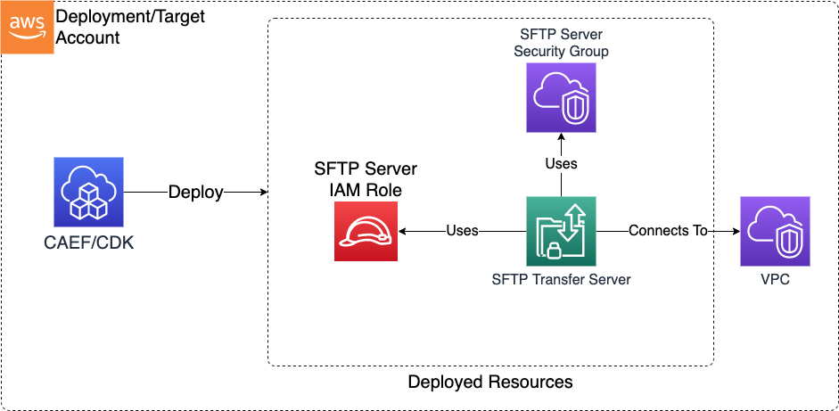

# SFTP Server

The SFTP Server CDK application is used to deploy the resources for an SFTP Transfer Family domain inside an account/VPC.

***

## Deployed Resources and Compliance Details



**SFTP Service Role** - A role which can be assumed by the SFTP Transfer Family service in order to run the service and create logs within the account.

**SFTP Server Security Group** - A security group which defines who can connect to the SFTP Server.

* This SG will be bound to the network interfaces created for the server on the VPC and could optionally be public facing.
* All ingress is denied by default

**SFTP Transfer Server** - This SFTP Transfer server will be created within the account and bound to the specified VPC and subnets.

***

## Configuration

### MDAA Config

Add the following snippet to your mdaa.yaml under the `modules:` section of a domain/env in order to use this module:

```yaml
          sftp-server: # Module Name can be customized
            cdk_app: "@aws-caef/sftp-server" # Must match module NPM package name
            app_configs:
              - ./sftp-server.yaml # Filename/path can be customized
```

### Module Config (./sftp-server.yaml)

[Config Schema Docs](SCHEMA.md)

```yaml
server:
  # CIDR Addresses from which the SFTP server will be accessible on port 22
  ingressCidrs:
    - 10.0.0.0/8
    - 192.168.0.0/16
    - 172.16.0.0/12
  # The VPC the server will be deployed on
  vpcId: some-vpc-id
  # The subnets on which the SFTP server will have interfaces deployed on
  subnetIds:
    - some-subnet-id1
    - some-subnet-id2
  # If true (default false, a publicly accessible IP address will be bound to the server)
  internetFacing: false
```
