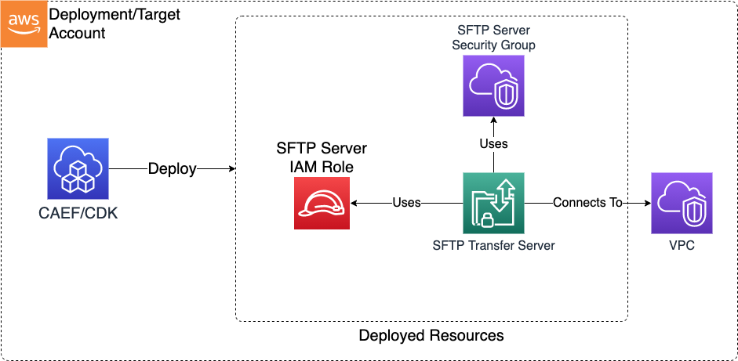

# SFTP Server

> **Note:** This documentation is also available in a rendered format [here](https://aws.github.io/modern-data-architecture-accelerator/packages/apps/utility/sftp-server-app/index.html).

Deploys an AWS Transfer Family SFTP server within a VPC with configurable network interfaces, security group ingress controls, and optional internet-facing access. Use this module when you need to provide external partners or legacy systems with a secure SFTP endpoint for uploading data into your AWS environment.

---

## Deployed Resources

This module deploys and integrates the following resources:

- **SFTP Service Role**: IAM role assumed by the Transfer Family service for running the server and creating logs within the account
- **SFTP Server Security Group**: Controls network connectivity to the SFTP server. Bound to VPC network interfaces.
- **SFTP Transfer Server**: Transfer Family SFTP server bound to the specified VPC and subnets, with optional public-facing Elastic IPs



---

## Related Modules

- [SFTP Users](../sftp-users-app/README.md) — Deploy SFTP user credentials and S3 home directory mappings for the server deployed here
- [Data Lake](../../datalake/datalake-app/README.md) — SFTP users can upload data directly into data lake S3 buckets
- [DataSync](../datasync-app/README.md) — Alternative data transfer method for automated, scheduled data movement

---

## Security/Compliance Details

This module is designed in alignment with MDAA security/compliance principles and CDK nag rulesets. Additional review is recommended prior to production deployment, ensuring organization-specific compliance requirements are met.

- **Encryption in Transit**:
  - All SFTP data transfer encrypted via SSH/SFTP protocol
- **Least Privilege**:
  - Dedicated IAM service role with scoped permissions for Transfer Family operations and CloudWatch logging
- **Network Isolation**:
  - Server is VPC-bound with security group controlling all inbound access
  - All ingress denied by default
  - Only explicitly configured CIDR ranges are allowed on port 22

---

## AWS Service Endpoints

The following VPC endpoints may be required if public AWS service endpoint connectivity is unavailable (e.g., private subnets without NAT gateway, firewalled environments, or PrivateLink-only architectures):

| AWS Service     | Endpoint Service Name                    | Type      |
| --------------- | ---------------------------------------- | --------- |
| Transfer Family | `com.amazonaws.{region}.transfer.server` | Interface |
| CloudWatch Logs | `com.amazonaws.{region}.logs`            | Interface |
| S3              | `com.amazonaws.{region}.s3`              | Gateway   |
| STS             | `com.amazonaws.{region}.sts`             | Interface |

---

## Configuration

### MDAA Config

Add the following snippet to your mdaa.yaml under the `modules:` section of a domain/env in order to use this module:

```yaml
sftp-server: # Module Name can be customized
  module_path: '@aws-mdaa/sftp-server' # Must match module NPM package name
  module_configs:
    - ./sftp-server.yaml # Filename/path can be customized
```

### Module Config Samples and Variants

Copy the contents of the relevant sample config below into the `./sftp-server.yaml` file referenced in the MDAA config snippet above.

#### Minimal Configuration

Contains only the required properties for deploying an AWS Transfer Family SFTP server with VPC networking and CIDR-based access control. Start here for a basic private SFTP server in your VPC.

[sample-config-minimal.yaml](sample_configs/sample-config-minimal.yaml)

```yaml
# Contents available via above link
--8<-- "target/docs/packages/apps/utility/sftp-server-app/sample_configs/sample-config-minimal.yaml"
```

#### Comprehensive Configuration

Deploys an AWS Transfer Family SFTP server with VPC networking, ingress CIDR restrictions, optional public IP allocation, and a custom security policy. Start here when evaluating all available options for public-facing access, security policies, and multi-subnet deployment.

[sample-config-comprehensive.yaml](sample_configs/sample-config-comprehensive.yaml)

```yaml
# Contents available via above link
--8<-- "target/docs/packages/apps/utility/sftp-server-app/sample_configs/sample-config-comprehensive.yaml"
```

---

[Config Schema Docs](SCHEMA.md)
