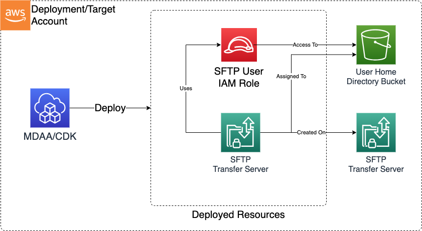

# SFTP Users

The SFTP Users CDK application is used to deploy the resources required to provision SFTP user credentials for a deployed SFTP Transfer Family Server.

***

## Deployed Resources and Compliance Details



**SFTP User** - For each configured User, and SFTP Transfer Family User will be created with the specified SSH Public key credentials.

* Corresponding private key is expected to be managed externally to the config

**SFTP User IAM Role** - If an existing IAM role is not specified for a User in the config, a minimally-permissive IAM role will be automatically created and assigned to the user.

***

## Configuration

```yaml
# Id of the server to which users will be added.
serverId: ssm:/sample-org/shared/sftp-server/server/id

# Public SSH RSA Keys.  These will be used to authenticate against the SFTP server and user
publicKeys:
  - name: test-key1
    publicKey: ssh-rsa AAAAB3NzaC1yc2EAAAADAQABAAACAQCr1nEXAMPLEPubKey==
  - name: test-key22
    publicKey: ssh-rsa AAAAB3NzaC1yc2EAAAABJQAAAQEAsyyGZsEXAMPLEPubKey==

# The existing home buckets and existing KMS keys.  If these are cross account, assure the KMS key, and S3 bucket are shared with the account this is deployed within.
buckets:
  # This 
  - name: home-bucket1
    # Arn or SSM Parameter paths are accepted here
    bucketName: ssm:/path/to/ssm/param/bucket/name
    kmsKeyArn: ssm:/path/to/ssm/param/kms/arn

  - name: home-bucket2
    # Arn or SSM Parameter paths are accepted here
    bucketName: some_home_bucket_name
    kmsKeyArn: arn:{{partition}}:kms:{{region}}:{{account}}:key/1234abcd-12ab-34cd-56ef-1234567890ab

# The User Mapping to Buckets and Object Prefixes.
users:
  - name: test-user-1
    bucket: home-bucket1
    homeDirectory: /incoming
    # Optional existing role ARN or SSM parameter for the role to access the bucket na KMS Key.
    # If this isn't specified, a minimally scoped role will be created
    accessRoleArn: ssm:/path/to/ssm/param/role/arn
    publicKeys:
      - test-key1

  - name: test-user-2
    bucket: home-bucket2
    homeDirectory: /incoming
    # Optional existing role ARN or SSM parameter for the role to access the bucket na KMS Key.
    publicKeys:
      - test-key2
```
