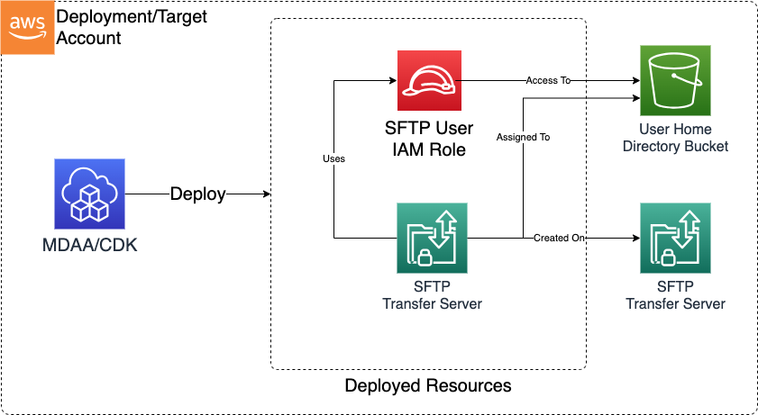

# SFTP Users

> **Note:** This documentation is also available in a rendered format [here](https://aws.github.io/modern-data-architecture-accelerator/packages/apps/utility/sftp-users-app/index.html).

Deploys AWS Transfer Family user credentials with SSH public key authentication, S3 home directory mappings, and optional auto-generated least-privilege IAM roles for bucket and KMS access. Use this module when you need to onboard SFTP users with scoped access to specific S3 buckets and directories on your Transfer Family server.

---

## Deployed Resources

This module deploys and integrates the following resources:

- **SFTP Users**: Transfer Family users created with SSH public key credentials and home directory mappings to S3 buckets. Private keys are managed externally.
- **SFTP User IAM Roles**: If an existing IAM role is not specified, a minimally-permissive role is automatically created with scoped-down S3 and KMS access policies for the user's assigned bucket and home directory.



---

## Related Modules

- [SFTP Server](../sftp-server-app/README.md) — Deploy the SFTP server that hosts the users configured here
- [Data Lake](../../datalake/datalake-app/README.md) — Map SFTP user home directories to data lake S3 buckets for direct data ingestion
- [Roles](../../governance/roles-app/README.md) — Create IAM roles that can be used as existing SFTP user access roles

---

## Security/Compliance Details

This module is designed in alignment with MDAA security/compliance principles and CDK nag rulesets. Additional review is recommended prior to production deployment, ensuring organization-specific compliance requirements are met.

- **Encryption at Rest**:
  - S3 buckets referenced by users are encrypted with KMS
  - User roles are granted access to the specified KMS keys
  - Cross-account KMS keys are supported
- **Least Privilege**:
  - Each user is scoped to a specific S3 bucket and home directory prefix
  - Auto-generated IAM roles follow least-privilege with S3 path-scoped policies
  - SSH public key authentication supports secure credential management

---

## Configuration

### MDAA Config

Add the following snippet to your mdaa.yaml under the `modules:` section of a domain/env in order to use this module:

```yaml
sftp-users: # Module Name can be customized
  module_path: '@aws-mdaa/sftp-users' # Must match module NPM package name
  module_configs:
    - ./sftp-users.yaml # Filename/path can be customized
```

### Module Config Samples and Variants

Copy the contents of the relevant sample config below into the `./sftp-users.yaml` file referenced in the MDAA config snippet above.

#### Minimal Configuration

Provisions a single AWS Transfer Family SFTP user with SSH public key authentication, one S3 bucket, and a home directory mapping. Start here for a basic SFTP user with access to a single S3 bucket.

[sample-config-minimal.yaml](sample_configs/sample-config-minimal.yaml)

```yaml
# Contents available via above link
--8<-- "target/docs/packages/apps/utility/sftp-users-app/sample_configs/sample-config-minimal.yaml"
```

#### Comprehensive Configuration

Provisions AWS Transfer Family SFTP users with SSH public key authentication, scoped S3 bucket access, and home directory mappings. Start here when evaluating all available options for multiple users, custom IAM roles, cross-account KMS keys, and home directory configurations.

[sample-config-comprehensive.yaml](sample_configs/sample-config-comprehensive.yaml)

```yaml
# Contents available via above link
--8<-- "target/docs/packages/apps/utility/sftp-users-app/sample_configs/sample-config-comprehensive.yaml"
```

---

[Config Schema Docs](SCHEMA.md)
