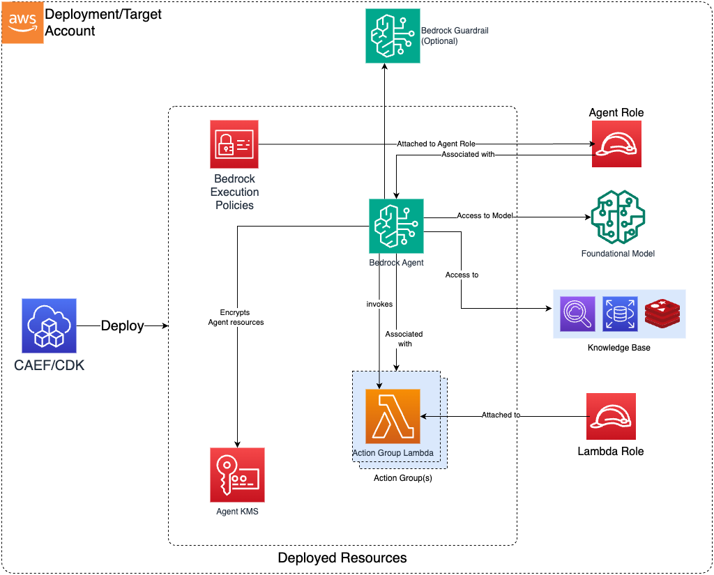

# Construct Overview

The Bedrock Agent CDK L3 construct is used to configure and deploy a secure Bedrock Agent and associated resources. 
***

## Deployed Resources

* **Bedrock Agent**: Deploys Amazon Bedrock Agent(s) to streamline workflows and/or automate repetitive tasks using Foundational Models
* **Bedrock Execution Policy**: Allows Bedrock Agent Role to access Knowledge Base, Foundational Model and Bedrock Guardrails.
* **Agent Execution Role**: Bedrock Execution Policy will be attached to the External Agent Role. This role should have Bedrock Service as a Trusted Principal. 
* **Agent KMS Key**: Encrypt Agent resources with the KMS Key. One will be generated if a KMS key is not provided as part of Agent Configuration
* **Lambdas**: (Optional) Allows you to generate Lambda Layer, Lambda Function or both, which can be associate with Agent Action Group. (*Refer: [MDAA DataOps-LambdaFunctions](../../dataops/dataops-lambda-app/README.md)*)
  * **Lambda Layers** - Lambda layers which can be used in Lambda functions (inside or outside of this config).
  * **Lambda Functions** - Lambda function(s) for Agent Action Group(s)
    * May be optionally VPC bound with configurable VPC, Subnet, and Security Group Paramters

    * Can use an existing security group (from Project, for instance), or create a new security group per function
    * If creating a per-function security group:

      * All egress allowed by default (configurable)
      * No ingress allowed (not configurable)
* **Action Group(s)**: Create Agent Action group for Bedrock Agent. It allows you to either use an existing Lambda function (by providing its ARN directly) or create a new one as part of the agent configuration. The `generated-function:` prefix tells the system to use the Lambda that was created from the configuration rather than looking for an existing function ARN

* **Bedrock Guardrail**: (Optional) If Bedrock Guardrail is mentioned in the configuration, the Agent will be associate with Bedrock Guardrail. 
  
  *Bedrock execution policy will also be updated to allow `ApplyGuardrail` permission on the provided `GuardrailID`*
