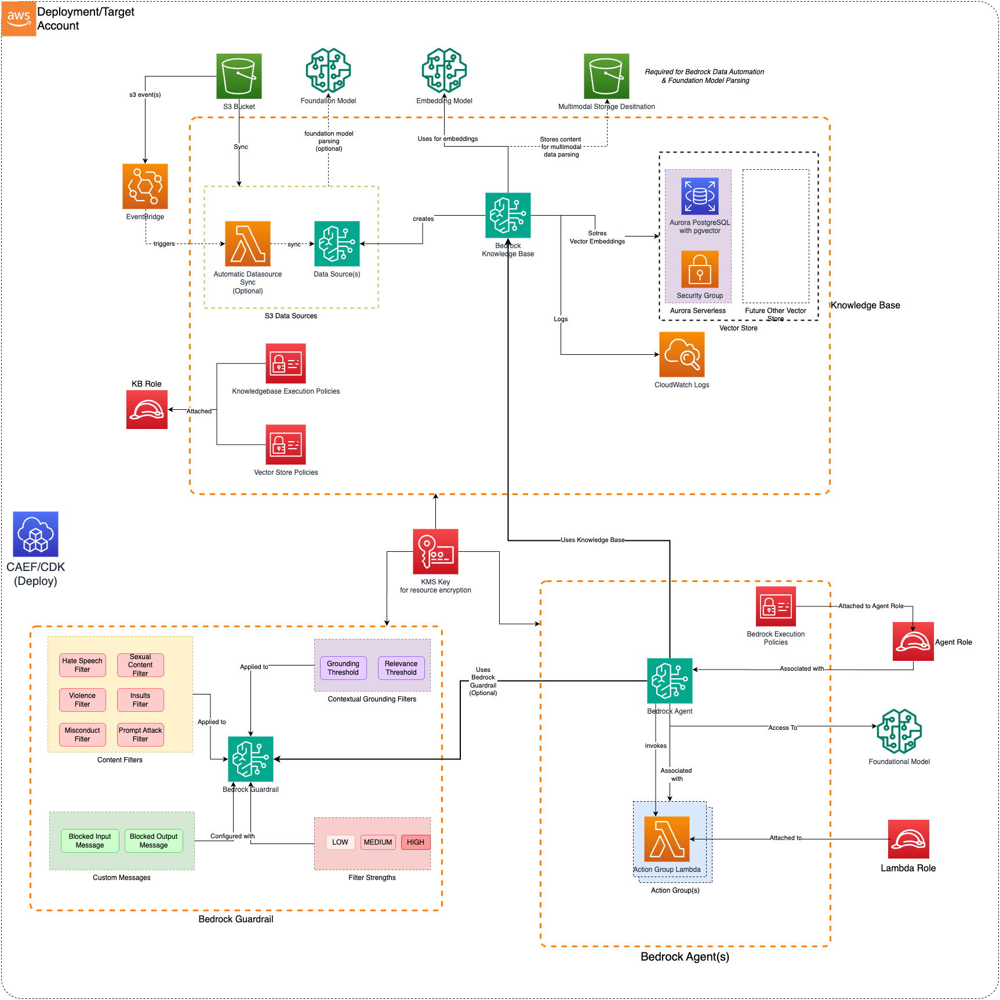

# Construct Overview

The Bedrock Builder CDK L3 construct is used to configure and deploy a secure Bedrock Builder and associated resources. 
***

## Deployed Resources



* **Bedrock Builder**: Deploys Amazon Bedrock Components(s) to streamline workflows and/or automate repetitive tasks using Foundational Models
* **Bedrock Execution Policy**: Allows Bedrock Role to access Knowledge Base, Foundational Model and Bedrock Guardrails.
* **Bedrock Execution Role**: Bedrock Execution Policy will be attached to the External Agent Role. This role should have Bedrock Service as a Trusted Principal. 
* **Bedrock KMS Key**: Encrypt Bedrock resources with the KMS Key. One will be generated if a KMS key is not provided as part of Configuration
* **Lambdas**: (Optional) Allows you to generate Lambda Layer, Lambda Function or both, which can be associate with Agent Action Group. (*Refer: [MDAA DataOps-LambdaFunctions](../../dataops/dataops-lambda-app/README.md)*)
  * **Lambda Layers** - Lambda layers which can be used in Lambda functions (inside or outside of this config).
  * **Lambda Functions** - Lambda function(s) for Agent Action Group(s)
    * May be optionally VPC bound with configurable VPC, Subnet, and Security Group Paramters

    * Can use an existing security group (from Project, for instance), or create a new security group per function
    * If creating a per-function security group:

      * All egress allowed by default (configurable)
      * No ingress allowed (not configurable)
* **Action Group(s)**: Create Agent Action group for Bedrock Agent. It allows you to either use an existing Lambda function (by providing its ARN directly) or create a new one as part of the agent configuration. The `generated-function:` prefix tells the system to use the Lambda that was created from the configuration rather than looking for an existing function ARN

* **Bedrock Guardrail**: (Optional) If Bedrock Guardrail is mentioned in the configuration, the Agent will be associate with Bedrock Guardrail. 
  
  *Bedrock execution policy will also be updated to allow `ApplyGuardrail` permission on the provided `GuardrailID`*

* **OpenSearch Serverless VPC Endpoints**: For OpenSearch Serverless vector stores, the construct automatically creates VPC endpoints for secure connectivity. If you already have an existing VPC endpoint for OpenSearch Serverless in your VPC, you can provide the endpoint ID and security group ID in the vector store configuration to reuse it instead of creating a new one. This prevents deployment failures when a VPC endpoint already exists.

## Configuration

### Using Existing OpenSearch Serverless VPC Endpoints

If you already have an OpenSearch Serverless VPC endpoint in your VPC, you can configure the vector store to use it instead of creating a new one. This is useful when:

- You have an existing VPC endpoint that you want to reuse across multiple deployments
- You want to avoid deployment failures caused by attempting to create duplicate VPC endpoints
- You need to manage VPC endpoints separately from your Bedrock deployment

To use an existing VPC endpoint, add the `ossVpce` property with `vpceId` and `securityGroupId` to your OpenSearch Serverless vector store configuration:

```yaml
vectorStores:
  my-vector-store:
    vectorStoreType: OPENSEARCH_SERVERLESS
    vpcId: "vpc-1234567890abcdef0"
    subnetIds: 
      - "subnet-1234567890abcdef0"
      - "subnet-0987654321fedcba0"
    standbyReplicas: ENABLED
    # Provide existing VPC endpoint details to reuse instead of creating new
    ossVpce:
      vpceId: "vpce-1234567890abcdef0"
      securityGroupId: "sg-1234567890abcdef0"
```

**Important Notes:**
- The `ossVpce` configuration is only applicable to OpenSearch Serverless vector stores (not Aurora Serverless)
- Both `vpceId` and `securityGroupId` must be provided together within `ossVpce`
- If multiple OpenSearch Serverless vector stores use the same VPC, they must all use the same existing VPC endpoint configuration or all create a new one
- The existing VPC endpoint must be configured for OpenSearch Serverless service
- The security group must allow appropriate network access for your use case

For a complete configuration example, see [sample_configs/genai_accelerator/ai/bedrock-builder.yaml](../../../../sample_configs/genai_accelerator/ai/bedrock-builder.yaml).
