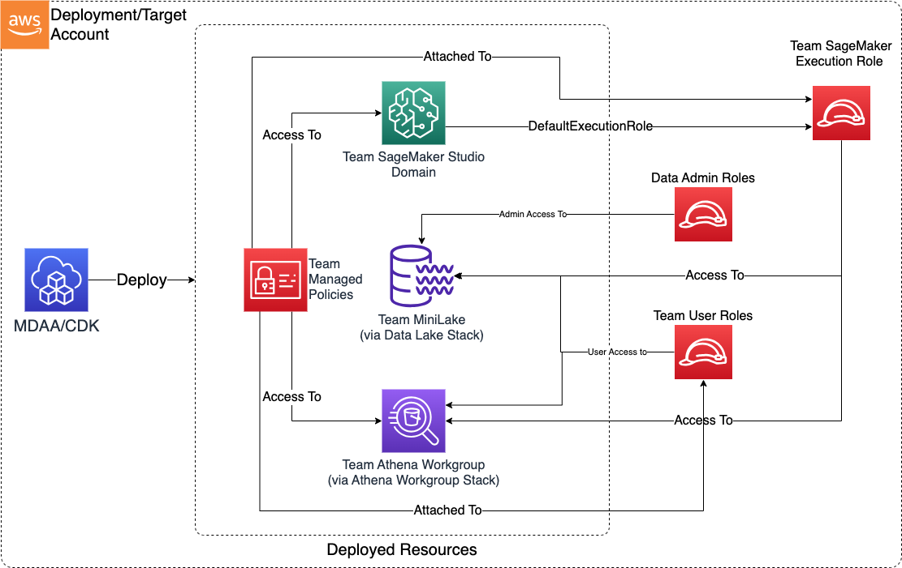

# Data Science Team CDK L3 Construct

The Data Science Team CDK L3 Construct is used to deploy sub L3 constructs and resources which support Data Science team activities within an AWS account.

***

## Deployed Resources

* **Team Mini Lake** - An S3-based mini data lake which the team can use as a persistence layer for their activities. Deployed using the [Datalake KMS and Buckets L3 Construct](../../datalake/datalake-L3-construct/README.md).

* **Team Athena Workgroup** - An Athena Workgroup for use by the team. Deployed using the [Athena Workgroup L3 Construct](../../datalake/athena-workgroup-L3-construct/README.md).

* **Team SageMaker Execution Role** - An IAM role which can be used by the team when interacting with SageMaker. Deployed using the [Roles L3 Construct](../../utility/roles-L3-construct/README.md).

* **SageMaker Studio Domain and User Profiles** - SageMaker Studio Domain configured to use the Team Execution Role, with optional user-specific User Profiles
