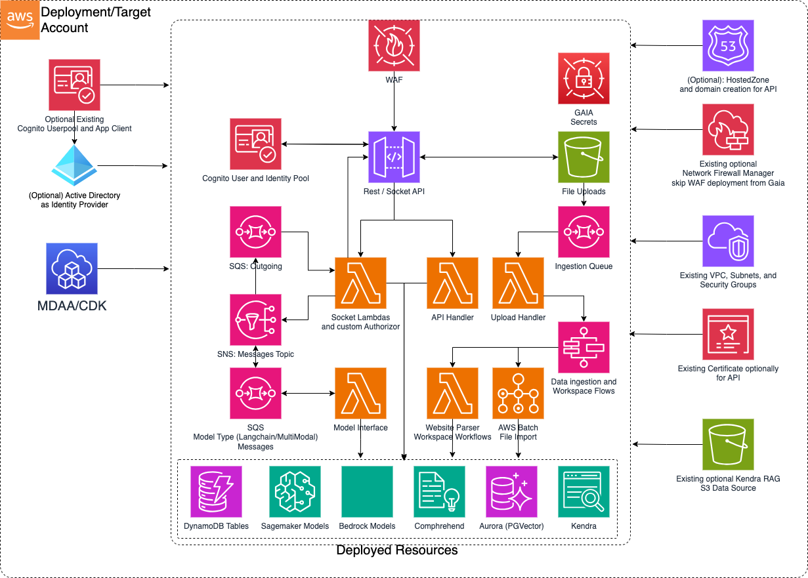

# GAIA - GenAI Accelerator CDK L3 Construct

The GAIA L3 Construct is used to deploy sub L3 constructs and resources which support a foundational set of backends to implement various GenAI applications.

***

## Deployed Resources

* **Web Application Firewall (WAF)** - By default a WAF is deployed in front of the API gateway with an approved CIDR range that can be provided by configuration.  Optionally, you can opt out of WAF if your organization supports Firewall Manager environments where WAF is applied automatically.
* **Rest/Socket API** - API Gateway based entry points to the GenAI backend, socket, and RAG files ingestion buckets gated by Cognito and Authorizers
* **Socket Lambdas** - Custom Authorizer, Incoming, Outgoing, and Connections lambdas that broker the messages going through the websocket API
* **Rest API Handler** - Lambda that handles Restful CRUD operations for workspaces, prompt templates, data ingestion, models and semantic search
* **SNS Messages Topic** - Acts as the topic broker for all SQS queues that interact with the model interfaces and outgoing messages
* **Model Types Queues** - Queues for incoming and outgoing messages that are handled by the socket and model interface lambdas
* **Model Interface** - Lambdas that handle incoming messages from the SQS queues and interface with embedding models, rag engines, and LLMs via Sagemaker and Bedrock, depending on configuration
* **Upload Files Bucket** - An S3 bucket that serves as a trigger source to the SQS ingestion queue that receives file uploads to be ingested into the RAG stores
* **Ingestion Queue** - A queue that listens to s3 put events and consumed by a lambda that will handle the file upload events in the Queue
* **Upload Handler** - Lambda that consumes the Ingestion Queue events and triggers the step functions flow according to what data type was ingested
* **DynamoDB Tables** - GAIA deploys several DynamoDB tables to manage functionality
  * **Connections Table:** - A table used by the Connections handler socket lambda which brokers connections to the websocket
  * **Sessions Table:** - A table that connects Connections to chat sessions and stores the dialogue along with meta data.  This table is used by the model interface lambdas mainly
  * **Workspaces Table:** - When Aurora RAG is enabled, this table stores metadata about the workspaces like name and backing RAG engine along with other settings around RAG strategy.
  * **Documents Table:** - When Aurora RAG is enabled, this table stores metadata about documents that are ingested in workspaces.  This data is used to show statistics around documents ingested along with document specific metadata.
* **Data Ingestion and Workspace Flows** - Step functions / State Machines for handling various asynchronous workflows revolving around vector store ingestion and workspace admin
  * **AWS Batch File Import:** - Unstructured.io driven container fleet with AWS batch that handle the various types of data ingestion which all are written as files to upload bucket except for website crawling
  * **Website Crawler:** - A Lambda that handles crawling a website and optionally can traverse the links and crawl various pages
  * **Create/Delete Workspace:** - Lambdas to create workspaces by establishing tables in vector databases along with the DynamoDB metadata tables based if Aurora RAG engine is enabled
* **Rag Engines** - GAIA supports Kendra Retrieval API and Aurora Serverless Postgres PgVector out of the box driven by configuration, and RAG engines are optional
  * **Aurora Serverless (PgVector):** - Deploy an Aurora Serverless cluster with custom resources to setup the Vector Store.  This option will trigger at least a Cross Encoder hosted on SageMaker (Cost Implication)
    * **Sagemaker RAG Models:** - At minimum with Aurora RAG, a cross encoder model () is deployed to support passage ranking.  Depending on configuration, any embedding models with provider 'sagemaker' will be included in this Sagemaker inference endpoint.
    * **Bedrock RAG Models:** - Titan Embedding is supported out of the box that can be included in the configurations.
  * **Kendra** - Integrate with an external Kendra index or deploy a Kendra index to serve as your RAG engine
    * **Existing S3 Datasource:** - Optionally there are configuration for an existing data source when opting to create a Kendra index (Configuration details in Sample)
* **Large Language Models** - GAIA supports various options for LLM integration out of the box
  * **Sagemaker LLMs:** - Out of the box adapters for Falcon, Mistral, and Mixtral are supported.  Deploying one or more of the models is driven by configuration.
  * **Bedrock LLMs:** - Claude, Jurassic, Cohere, Mistral, and Titan have adapters out of the box.  Enabling bedrock is driven by configuration with cross region support.  Consult regulatory restrictions before usage if out of region.
  * **3rd Party LLMs:** - GAIA also supports third party models out of the box with an Adapter for ChatGPT.  The API key is stored as an AWS Secret and only read and never logged or stored at runtime.
* **Comprehend** - Used in to infer the dominant language for prompts coming in to the LLM models and when ingesting to Aurora Vector store to support multi-lingual semantic search.
* **Authentication** - GAIA handles various options for authentication and verification of the stack
  * **Deployed:**
    * **Username / Password** - The most basic option is to deploy the Cognito pieces to facilitate Username/Password flow authentication.
    * **Active Directory Identity Provider** - GAIA optionally accepts configurations to integrate with an existing AD Enterprise Application authentication Flow (Configuration details in Sample)
  * **Existing:** - There are instances where a Userpool and App Client already exist for another stack.  Where we want to integrate GAIA as an extension backend to an existing application, existing Cognito resources options are available.
* **Hosted Zone and Domain Creation for API** - Optionally some configuration can be supplied to setup custom domain along with ACM certificates for API Gateway endpoints (Configuration details in Sample)
* **GAIA Secrets**- There are several secrets that are stored, some optionally stored based on configuration
  * **DB Secret**- This secret is always deployed., generated by the Database and rotated by a lambda based on a duration given with a default of 30 days
  * **X-Origin-Virify** - This secret is used by the rest api handler lambda to verify that only a specific origin with the know if the origin header secret can communicate with the backend.  The secret header is rotated every 30 days by default
  * **API Keys** - If provided as configuration, 3rd Party LLM API keys are stored as secrets and used by the model interface lambdas.  The keys are never logged.