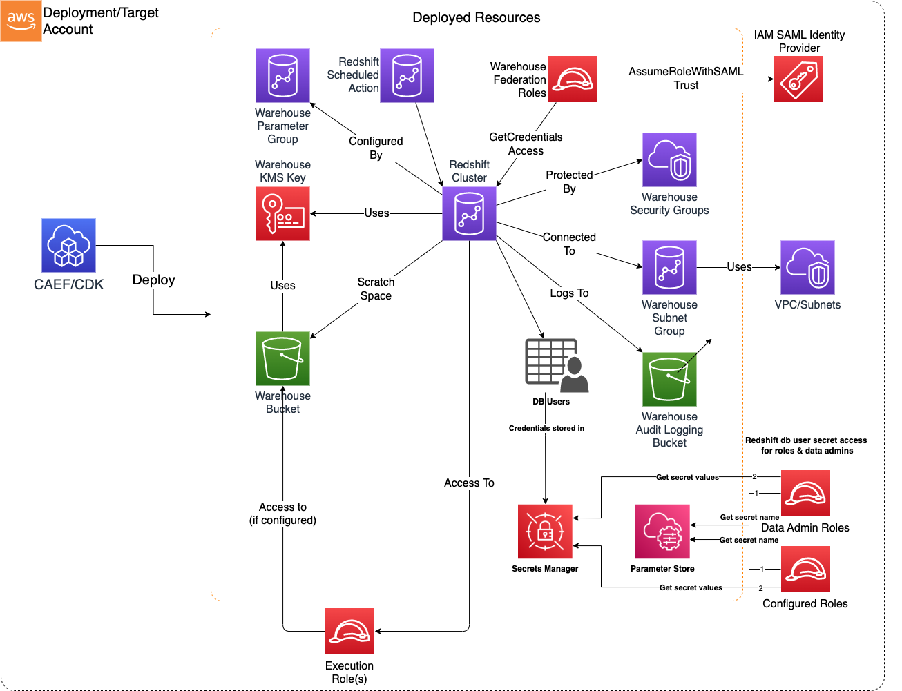

# Construct Overview

The Data Warehouse CDK L3 construct is used to deploy resources required for a secure Redshift-based Data Warehouse on AWS.

***

## Deployed Resources

* **Warehouse KMS Key** - Will be used to encrypt all warehouse data at rest (Warehouse bucket, Redshift Cluster).

* **Warehouse Bucket** - An S3 Bucket which can be used for warehouse utility operations.

* **Warehouse Logging Bucket** - If 'enableAuditLoggingToS3' specified in config, an S3 Bucket specific to Redshift user activity logging will be created. This bucket will be configured with SSE-S3 due to Redshift logging requirements (KMS not supported).

* **Warehouse Execution Roles** - An IAM role will be created for each execution role specified in the config. Access to these roles may be granted to Redshift users in order to interact with other AWS services through Redshift queries and commands.

* **Warehouse Security Group** - Will control who can connect to the cluster according to the app config (CIDR ranges, other Security Groups).

* **Warehouse Subnet Group** - Controls which subnets the cluster will be deployed on.

* **Warehouse Parameter Group** - Contains cluster config parameters required to control cluster behaviour and ensure secure operation.

* **Warehouse Cluster** - A Redshift cluster conforming to the specified configuration and security controls.

* **Warehouse Federation Roles** - Roles which are used via IAM SAML Identity Providers to federate access to the cluster
