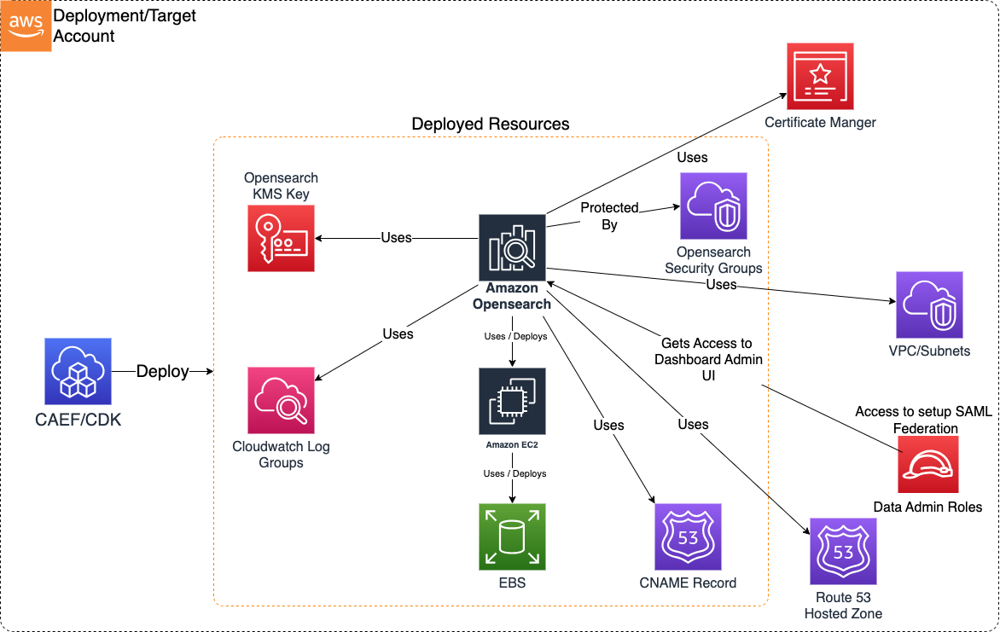

# Construct Overview

The Opensearch CDK L3 construct is used to deploy resources required for a secure Opensearch domain on AWS.

***

## Deployed Resources

* **Opensearch KMS Key** - Will be used to encrypt all data at rest (cluster nodes and storage).

* **Cloudwatch Log Groups** - Will be used to log Application logs, Audit logs, Index Slow logs, Search Slow logs.

* **Amazon EC2** - Opensearch cluster nodes are hosted on EC2 instances (master nodes, data nodes, ultrawarm data nodes)

* **EBS** - Data at rest will be stored in EBS storage (encrypted by KMS key) attached to data nodes.

* **CNAME Record** - CNAME record is created in Private Hosted Zone (in Route 53) if hosted zone configuration is enabled along with custom endpoint.

* **Amazon Opensearch** - Opensearch Domain (including Opensearch Dashboards) conforming to security guardrails.