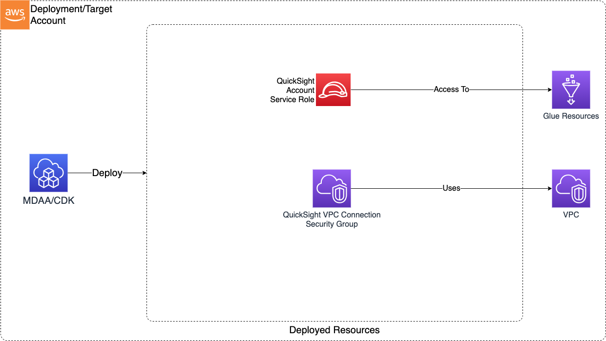

# Construct Overview

The QuickSight Account L3 construct is used to deploy resources required for use of QuickSight within an account.
***

## Deployed Resources

* **QuickSight Service Account** - Will be used by QuickSight to setup account-level resources.

* **QuickSight Security Group** - Will be used by QuickSight to facilitate connectivity to VPC-connected data sources such as RedShift
