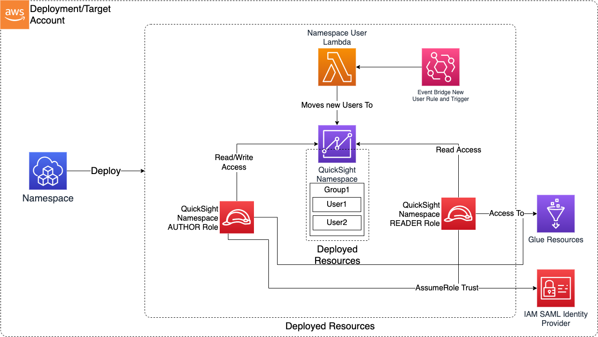

# Construct Overview

The QuickSight Namespace CDK application is used to configure and deploy following resources:
1. IAM roles suitable for federation into the Namespace
2. Quicksight Namespaces
3. Quicksight Users
4. Quicksight Groups
5. Moves the Quicksight User in Namespace and Group

***

## Deployed Resources

* **QuickSight Namespace** - Creates a QuickSight Namepsace via Custom Resource

* **QuickSight Namespace READER/AUTHOR Roles** - Creates IAM roles suitable for federation into the Namespace as either an AUTHOR or a READER

* **QuickSight Namespace User Lambda and EventBridge Trigger** - Watches for new users created using the Namespace AUTHOR or READER roles and automatically moves them into the namespace from the default namespace. Also, creates Quicksight Groups and moves the QS users into groups.
