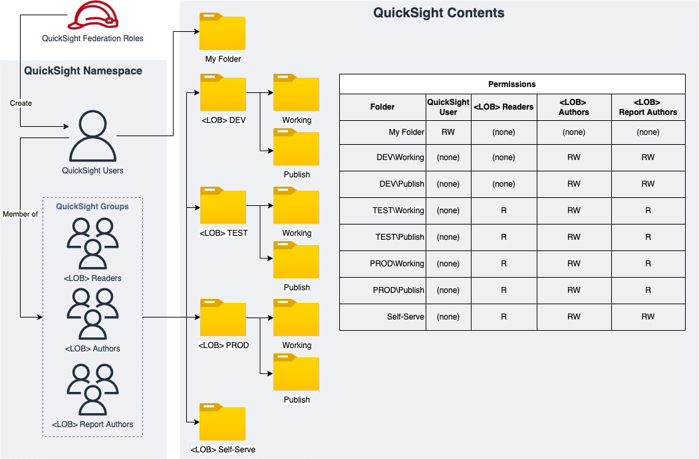

# Construct Overview

The QuickSight Project CDK L3 construct is used to configure and deploy below resources in Quicksight:
1. SharedFolders
2. QS Data Sources

***

## Deployed Resources
**QuickSight Permmissions: End to End Flow**

**Sample QuickSight Shared Folders for QS Asset Management**

**QuickSight Shared Folders Deployed Resources**

* **QuickSight SharedFolders** - Creates QuickSight Shared Folders(Root and Child Folders with Permissions to QS Groups) via Custom Resources + QS Data Sources

