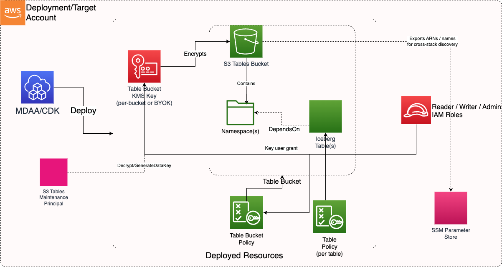

# @aws-mdaa/s3-tables-l3-construct

MDAA S3 Tables L3 Construct - orchestrates table buckets, namespaces, Iceberg tables, KMS encryption, IAM policies, and SSM parameter exports from configuration.

## Architecture

The editable source is [docs/S3Tables.drawio](docs/S3Tables.drawio) (open with [diagrams.net](https://app.diagrams.net/) or the Draw.io Integration extension).

## Features

- Creates table buckets with mandatory KMS encryption
- Provisions namespaces and Iceberg tables with schema definitions
- Generates deny-by-default resource policies with TLS enforcement
- Maps permission sets (reader/writer/admin) to least-privilege action sets
- Exports resource ARNs and names to SSM Parameter Store
