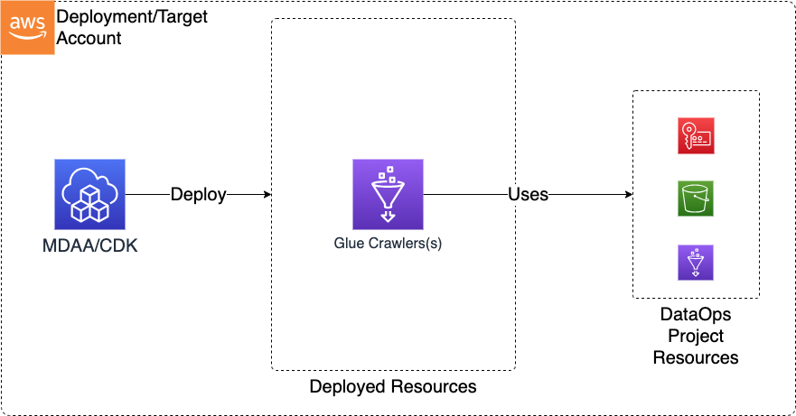

# Construct Overview

The Data Ops Crawler CDK L3 construct is used to deploy the resources required to support and perform data operations on top of a Data Lake, primarily using Glue Crawlers and Glue Jobs.

***

## Deployed Resources

* **Glue Crawlers** - Glue Crawlers will be created for each crawler specification in the configs
