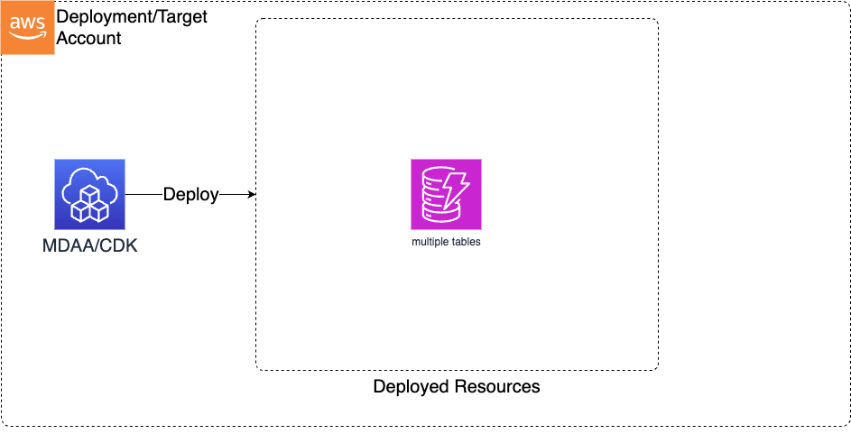

# Construct Overview

The Data Ops Dynamodb CDK L3 construct is used to deploy the resources required to orchestrate data operations on the data lake (primarily Glue Crawlers, Glue Jobs, Glue Workflows and Lambdas).

***

## Deployed Resources

* **Dynamodb** - Dynamodb tables will be created for each workflow specification in the configs
