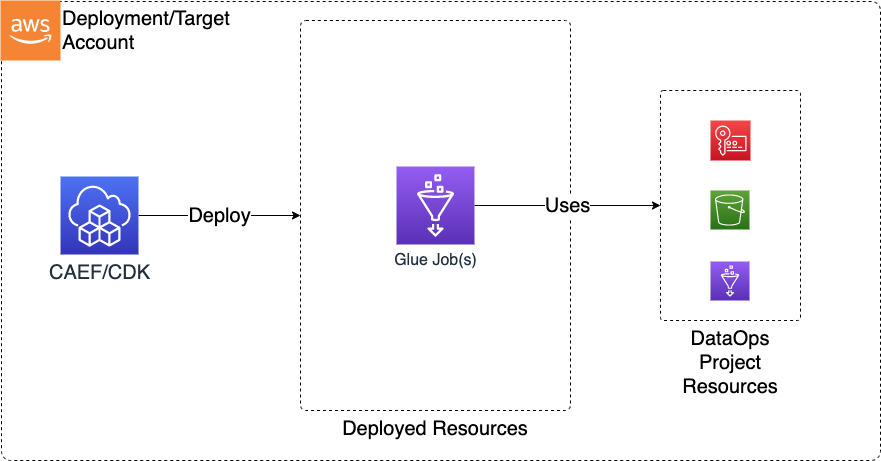

# Construct Overview

The Data Ops Job CDK L3 construct is used to deploy the resources required to support and perform data operations on top of a Data Lake using Glue Jobs.

***

## Deployed Resources

* **Glue Jobs** - Glue Jobs will be created for each job specification in the configs

## Optional Features

### Asset Script Resolution
Set `assetBasePath` on the construct props to enable `asset:` prefixed paths in `scriptLocation` and `additionalScripts`. When a path starts with `asset:`, it is resolved relative to the configured base path (e.g., `asset:dq-main.py` resolves to `<assetBasePath>/dq-main.py`).
