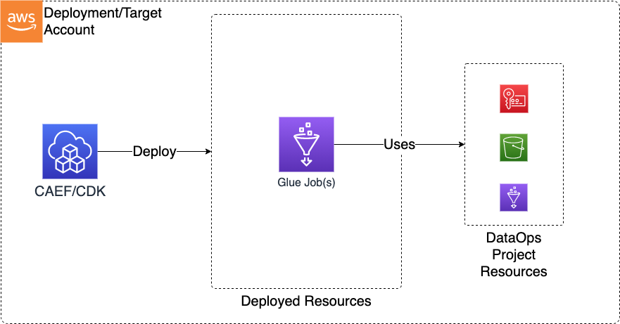

# Construct Overview

The Data Ops Job CDK L3 construct is used to deploy the resources required to support and perform data operations on top of a Data Lake using Glue Jobs.

***

## Deployed Resources

* **Glue Jobs** - Glue Jobs will be created for each job specification in the configs

## Optional Features

### Asset Script Resolution
Set `assetBasePath` on the construct props to enable `asset:` prefixed paths in `scriptLocation` and `additionalScripts`. When a path starts with `asset:`, it is resolved relative to the configured base path (e.g., `asset:dq-main.py` resolves to `<assetBasePath>/dq-main.py`).

### DataZone Data Lineage
Set the optional `lineage` section on a job config (`enabled`, `domainId`, optional `accountId`, optional `manageExecutionRolePolicy`) to emit OpenLineage events to an Amazon DataZone / SageMaker Unified Studio domain. When enabled, the construct injects the OpenLineage Spark listener configuration into the job's `--conf` argument, preserving any user-supplied `--conf`. Requires Glue version 5.0 or higher (enforced with a synth-time error). When enabled, the construct attaches a managed policy granting `datazone:PostLineageEvent` to the job execution role, scoped to the domain ARN in the deploying account; set `manageExecutionRolePolicy: false` to skip the attachment when the role is externally managed. The optional `accountId` sets only the Glue Data Catalog account (`spark.glue.accountId`) and must be a 12-digit AWS account ID.
