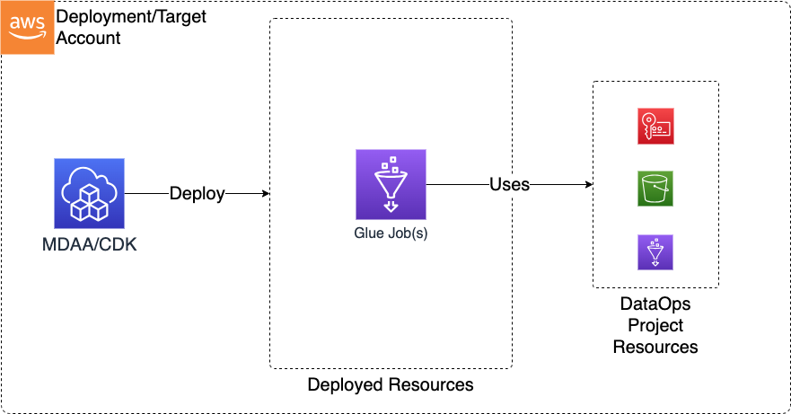

# Construct Overview

The Data Ops Job CDK L3 construct is used to deploy the resources required to support and perform data operations on top of a Data Lake using Glue Jobs.

***

## Deployed Resources

* **Glue Jobs** - Glue Jobs will be created for each job specification in the configs
