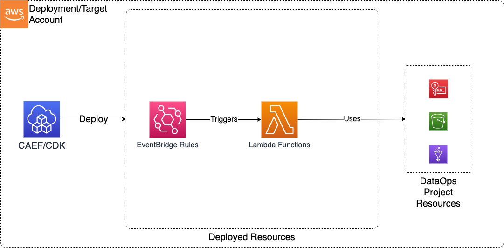

# Construct Overview

The Data Ops Lambda CDK L3 construct is used to deploy the resources required to orchestrate data operations on the data lake using Lambda functions. The Lambda functions can currently be triggered by S3 EventBridge notifications (Required to be enabled on the source buckets) and EventBridge Rules.

***

## Deployed Resources

* **Lambda Functions** - Lambdas will be created for each function specification in the configs
* **EventBridge S3 Rules** - EventBridge rules for triggering Lambda functions with S3 Object Created Events
