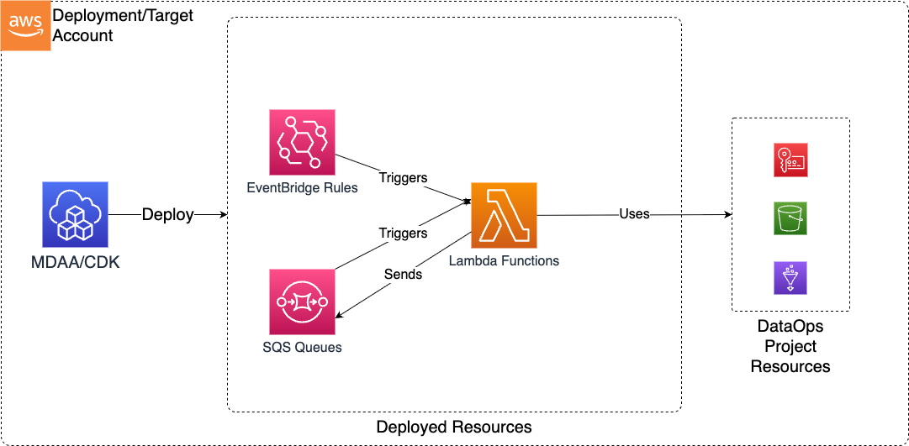

# Construct Overview

The Data Ops Lambda CDK L3 construct is used to deploy the resources required to orchestrate data operations on the data lake using Lambda functions. The Lambda functions can currently be triggered by S3 EventBridge notifications (Required to be enabled on the source buckets), EventBridge Rules, and SQS queues.

---

## Deployed Resources

- **Lambda Functions** - Lambdas will be created for each function specification in the configs
- **EventBridge S3 Rules** - EventBridge rules for triggering Lambda functions with S3 Object Created Events
- **SQS Queues** - A CMK-encrypted standard or FIFO queue, plus a redrive dead letter queue, will be created for each queue specification in the configs
- **SQS Event Source Mappings** - Event source mappings for polling a queue and invoking a Lambda function with batches of messages

Queue permissions are granted to a function's execution role through the queue resource policy, because this construct removes the inline policy CDK attaches to each execution role in order to avoid the `IAMNoInlinePolicy` findings. A function declaring `sqsEventSources` is granted the consume actions; one declaring `queueUrlEnvironment` is granted `sqs:SendMessage`. Functions granted the same actions on the same queue share one policy statement.

Validated at synthesis time: a queue's visibility timeout must be at least the timeout of every function consuming it, generated queue names must not collide, and each queue name must satisfy the SQS naming rules — non-empty, alphanumeric characters with hyphens and underscores only, and without the `.fifo` suffix (set `fifo: true` instead). The `.` check matters because MDAA's general resource-name validation permits `.` so the FIFO suffix can survive, while SQS rejects it in a queue name.
