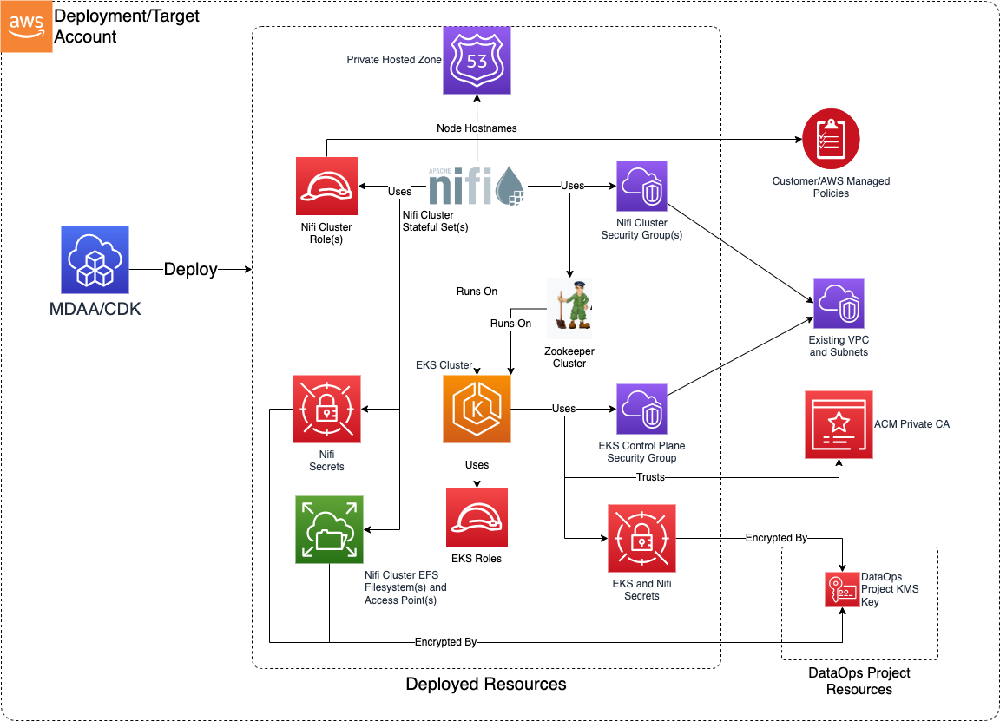

# Construct Overview

The Data Ops Nifi CDK L3 construct is used to deploy the resources required to orchestrate data operations on the data lake using Nifi clusters and flows.

***

## Deployed Resources

* **EKS Cluster** - A single EKS cluster is provisioned hosting Zookeeper and multiple Nifi clusters. The cluster is configured to run all pods on managed Fargate compute. All secrets are encrypted with the Data Ops project KMS Key. Additional services are deployed onto the EKS cluster to support Nifi:

  * **Internal CA** - A CA is provisioned internally (using a cert-manager Helm chart) on the EKS cluster for minting of all SSL certs required by both Nifi and Zookeeper. This internal CA will optionally use an external ACM Private CA to mint its certificate. CA certificate and private key secrets are stored internally within the cluster (encrypted by KMS).
  * **External Secrets** - An external secrets integration is deployed (using a Helm chart) onto the EKS cluster to allow consumption of AWS Secrets Manager secrets into the cluster.
  * **External DNS** - An external-dns integration is deployed (using a CDK8S chart) to facilitate automatic updating of Route53 private hosted zone with Nifi cluster node hostnames.
  * **Zookeeper Cluster** - A secured Zookeeper cluster is deployed (using a CDK8S chart) to facilitate Nifi cluster coordination. All Zookeeper communications are TLS-encrypted using certs minted by the internal CA.

* **Route53 Private Hosted Zone** - Used to provide resolution of Nifi cluster node hostnames.

* **Nifi Clusters** - Multiple Nifi clusters are deployed onto EKS as separate StatefulSets (using CDK8S charts), running in separate Namespaces. Each Nifi cluster has its own ServiceAccount connected to a separate IAM Role, which can be used by the cluster to access AWS services. All Nifi communications are TLS-encrypted using certs minted by the internal CA.

  * **Nifi EFS** - Each cluster node/pod is provided with PersistentVolumes running on a cluster-specific EFS FileSystem, with separate Access Points per cluster node. The Filesystem is encrypted using the DataOps project KMS key.
  * **Nifi Node Certs** -- Each cluster node is provision with a TLS certificate (signed by the internal CA) used for all interactions with other Nifi nodes and Zookeeper. The certificates and keys are mounted as JKS key stores into the Nifi pods from a Kubernetes Secret. The passwords for the JKS stores is stored in AWS Secrets Manager, and published to the Nifi container as a secret environment variable.
  * **Nifi Security Group** - A security group is provisioned for each Nifi cluster providing ingress/egress control to/from the cluster.
  * **Nifi Service Account Role** - An IAM role is provisioned for each cluster, bound to the Nifi StatefulSet as a ServiceAccount. This role may be granted access to AWS resources using either AWS or Customer Managed Policies.
