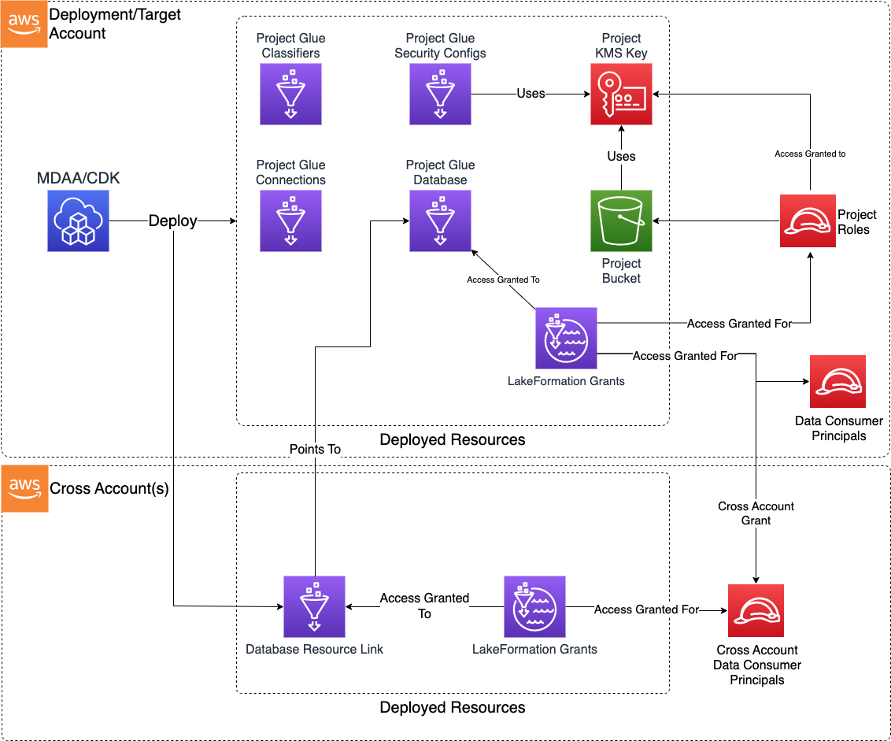

# Data Ops Project CDK L3 Construct

The Data Ops Project CDK L3 Construct is used to deploy the resources required to support and perform data operations on top of a Data Lake, primarily using Glue Crawlers and Glue Jobs.

***

## Deployed Resources

* **Project KMS Key** - Used to encrypt all project information at rest across all project resources.

* **Project S3 Bucket** - A storage location for project activities (scratch and temporary).

* **Glue Databases** - A Glue Catalog database will be created for each project database specified in the config.

* **Project Glue Security Config** - Security config which will be used by all jobs under the project
