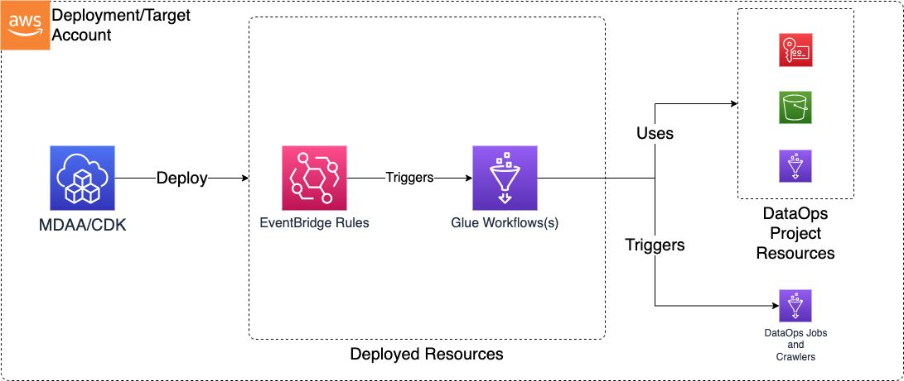

# Construct Overview

The Data Ops Workflow CDK L3 construct is used to deploy the resources required to orchestrate data operations on the data lake (primarily Glue Workflows).

***

## Deployed Resources

* **Glue Workflows** - Glue Workflows will be created for each workflow specification in the configs
