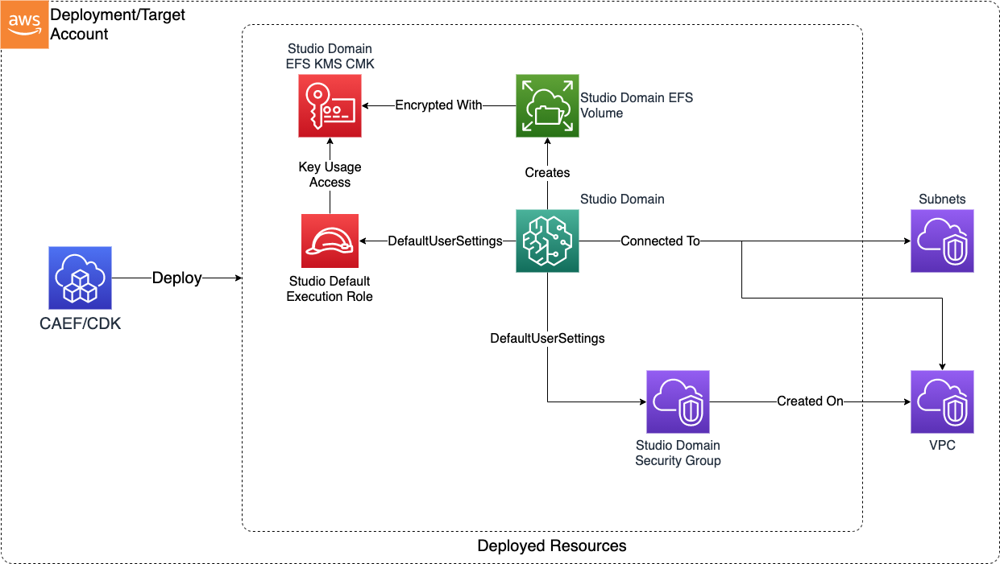

# Construct Overview

The SageMaker Studio Domain CDK L3 construct is used to configure and deploy a secure SageMaker Studio domain and associated resources. Note that only a single Studio domain can be deployed per AWS account.

***

## Deployed Resources

* **Studio Domain** - A secure Studio domain.

* **Studio Domain Security Group** - Will be used by all launched Studio apps to control network access to Studio resources and EFS.

* **Studio Default Execution Role** - The role with which Studio apps will be launched. By default this is a role with only the minimal permissions required to launch apps, but not access any other AWS services.

* **Studio EFS KMS CMK** - The KMS CMK which will be used to encrypt the SageMaker Domain EFS volume (created automatically by SageMaker).
